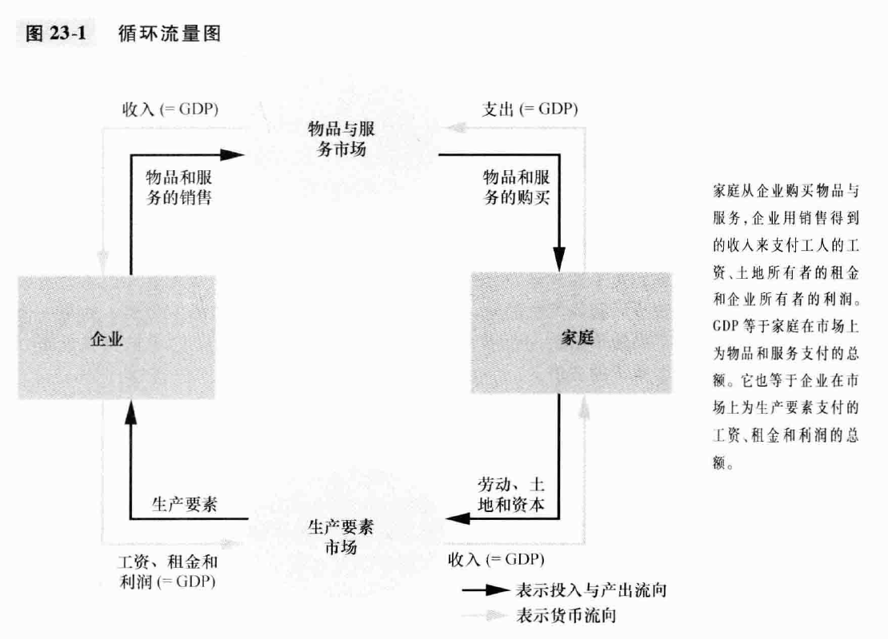
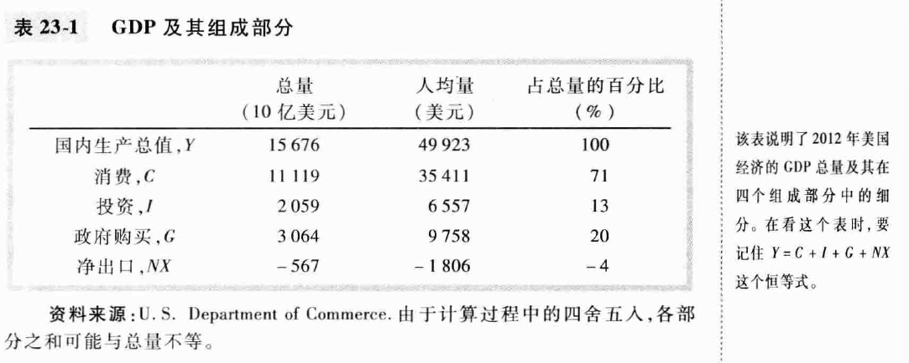
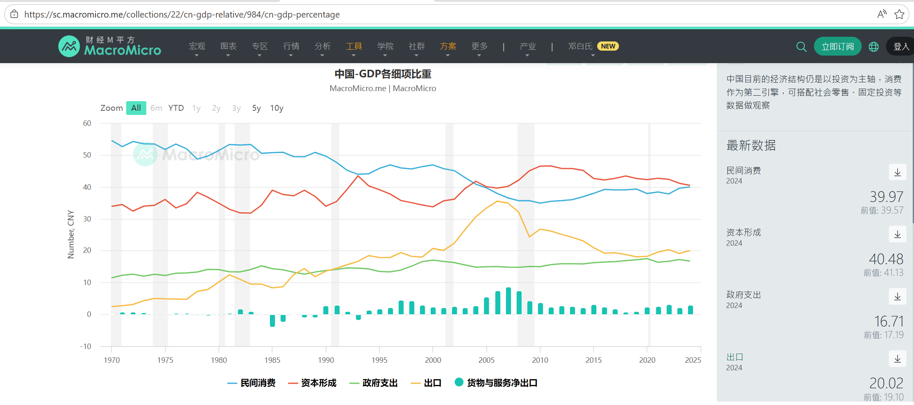
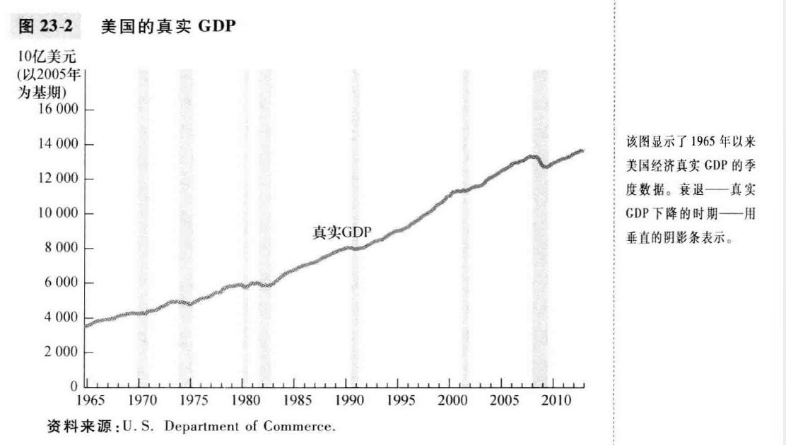

# chapter23-一国收入的衡量(page3-page24)

**微观经济学**研究家庭和企业如何做出决策, 以及他们如何在市场上相互影响. **宏观经济学**研究整个经济. 

本章考察 **国内生产总值**, 它衡量的是一国的总收入. GDP 是最受瞩目的经济统计数字, 因为他被认为是衡量社会经济福利最好的一个指标. 

## 23.1 经济的收入与支出

GDP 同时衡量两件事情, 经济中所有人的总收入和用于经济中物品与服务产出的总支出. 由于这两件事实际上是相同的, 所以GDP既衡量总收入又衡量总支出. **对一个整体经济而言, 收入必定等于支出**

交易对经济的收入和支出做出了相同的贡献. 每一次交易都有两方, 买者和卖者, 这样无论作为总收入还是总支出衡量, GDP 都是一致的. 

使用循环流量图, 我们可以描述一个简单经济中的家庭和企业之间的全部交易. 这个图假设所有物品和服务由家庭购买, 而且家庭指出了他们的所有收入而使事情简单化. 当家庭从企业购买物品和服务的时候, 这些支出通过 **物品和服务市场流动**; 当企业反过来从销售中的钱支付工人的工资, 土地所有者的租金和企业所有者的利润时, 这些收入通过**生产要素市场**流动. 

**GDP衡量货币的流量**. 在这个经济中, 我们可以加总家庭的总支出或者加总企业的总收入(工资,租金和利润)

但是, 现实的经济更复杂. 家庭不会指出全部收入: 部分收入会支付政府税收, 还要为了未来而把部分收入用来储蓄. 此外, 家庭并没有购买经济中生产的全部物品和服务: 一些物品与服务由政府购买, 还有一些由计划未来用这些物品与服务生产自己产品的企业购买. 

## 23.2 国内生产总值的衡量

下面是GDP的定义, 这个定义的中心是把GDP作为对总支出的衡量: **国内生产总值(gross domestic product), 是在某一既定时期内一个国家内生产的所有最终物品与服务的市场价值**

### 23.2.1 “市场价值”

GDP需要把许多种不同物品加总为一个经济活动价值的衡量指标, 因此使用**市场价格**. 如果一个苹果的价格是一个橘子价格的2倍, 那么一个苹果相对橘子来说对GDP的贡献就是两倍.

### 23.2.2 “所有..”

GDP要成为全面的衡量指标. 它包括在经济中生产并在市场上**合法出售的所有物品**. 

GDP还包括在经济中**住房存量**提供的住房服务的市场价值. 就租赁住房而言, 这种价值很容易计算, 就是租金. 但如果一个人对自己所住的房子有所有权, 所以并不付租金. 政府通过估算租金价值而把这种**自有房产的价值包括在GDP之中, 认为所有者将房屋出租给自己**. 

GDP不包括非法的内容, 比如毒品. 不包括在家庭内生产和消费的东西, 因为没有进入市场, 比如自己种的蔬菜如果自己吃就不包括在GDP. 

### 23.2.3 “..最终..”

当A公司生产出纸张, B公司用纸张生产贺卡的时候, 纸张被称为 **中间物品**, 贺卡被称为 **最终物品**, GDP只包括最终物品的价值, **因为中间物品的价值已经包括在最终物品的价值中**

当生产出来的一种中间物品没有被使用, 而是增加了企业以后使用或出售的存货时, 这个原则就出现了一个重要的例外. 这种情况下, 中间物品暂时作为最终物品, 其价值是作为存货投资成为GDP的一部分; 而当存货中的物品以后被使用或出售时, 存活的减少再从GDP中扣除. 

### 23.2.4 “物品与服务”

GDP包括有形的物品(食物,衣服,汽车), 又包括无形的服务(理发, 打扫房屋, 看病..).

### 23.2.5 “生产的”

GDP不包括涉及过去生产的物品的交易. 比如二手车交易不属于GDP

### 23.2.6 “一个国家内”

GDP衡量的生产价值局限在一个国家的地理范围之内.

### 23.2.7 “在一个既定时期内”

### 参考资料: 其他收入衡量指标

- **国民生产总值(GNP)**: 是一国永久居民(称为国民)所赚到的总收入, 它包括本国公民在国外赚到的收入; 一般来说, GDP和GNP是非常接近的
- **国民生产净值(NNP)**: 一国居民的总收入减去 **折旧**, 折旧是经济中设备和建筑物存量的磨损或消耗; 折旧也被称为“固定资本的消费”
- **国民收入**: 一国居民在物品和服务生产中赚到的总收入
- **个人收入**: 是家庭和非公司制企业得到的收入. 与国民收入不同, 个人收入不包括 **留存收益**--公司获得的但是没有支付给其所有者的收入. 他还要减去间接营业税, 公司所得税和对社会保障的支付. 个人收入还会包括家庭从政府转移支付项目中得到的收入, 比如福利和社会保障收入
- **个人可支配收入**: 是家庭和非公司制企业在完成它们对政府的义务之后剩下的收入. 个人收入减去个人税收和某些非税收支付(比如交通罚单)

## 23.3 GDP 的组成部分

经济中的支出有多种形式, 经济学家研究GDP在各种类型支出中的构成. GDP(用Y表示)被分为四个组成部分: **消费(C)**, **投资(I)**, **政府购买(G)**, **净出口(NX)**: 
$$
Y=C+G+I+NX
$$

### 23.3.1 消费

**消费(consumption)**, 是家庭除购买新住房之外, 用于物品与服务的支出. “物品”包括了汽车和家电等耐用品, 还有食品衣服等非耐用品. “服务”包括立法和医疗这类无形的东西, 家庭用于教育的支出也包括在服务消费中(也有人认为教育应该归结为投资)

### 23.3.2 投资

**投资(investment)**, 是对用于未来生产更多物品和服务的物品的购买. **它是资本设备, 存货和建筑物购买的总和**. 建筑物投资包括新住房支出. 按习惯, 新住房购买划分进投资而不划入消费的一种家庭支出形式. 

关于存货积累, 比如苹果公司生产了一台电脑但是不出售它, 而是将它加到其存货中, 则假设自己“购买了”这台电脑, 这是投资支出的一部分. 如果苹果公司以后卖出了存货中的这台电脑, 那么存货投资将是负的, 抵消了买者的正支出. (**因为GDP衡量的是经济生产的价值, 增加到存货中的物品时这个时期生产的一部分**)

### 23.3.3 政府购买

**政府购买(government purchase)** 表示政府用于物品与服务的支出. **它包括了政府员工的薪水和总投资**. 

当政府为了一个小学教师支付薪水的时候, 这份薪水是政府购买的一部分. 但是当政府向一个老年人支付社会保障补助的时候, 这就不是政府购买, 这些政府支出被称为 **转移支付**. 转移支付改变了家庭收入, **但是并不反应经济的生产**. (从宏观经济的角度来看, 转移支付有点像是负的税收)

### 23.3.4 净出口

**净出口(net export)**: 等于外国对国内生产的物品的购买(出口) 减去 国内对外国物品的购买(进口). 一家国内企业把产品卖给别国的买者, 这就增加了净出口. 

之所以要减去进口: GDP的其他组成部分包括了进口的物品与服务. 比如一个美国家庭从瑞典车企买了一辆4万美元的汽车, 这个交易增加了4万美元的 **消费**, 但是还减少了 **净出口**的4万美元, 两者就会抵消. 因此当家庭,企业或者政府购买了国外的物品与服务的时候, 这种购买减少了净出口, 这个时候GDP不受影响. 

### 案例研究: 美国GDP的组成部分

TODO: 看起来美国的消费占比非常高, 中国的民间消费占比较低, 资本形成占比较高? 中国和美国的GDP结构属于什么类型呢? 有没有什么典型的特点和发展趋势? 有没有相关的研究和比较确定性的结论? 

### 新闻摘录: 经济分析局改变了投资和GDP的定义

2013年, 经济分析局(Bureau of economic analysis, BEA), 将各种形式的知识产权的生产也计入. 

## 23.4 真实GDP与名义GDP

GDP衡量经济中所有市场上用于物品与服务的总支出. 如果从这一年到下一年的总支出增加了, 那么下面两种情况至少有一种是正确的:

1. 生产了更多的物品与服务
2. 以更高的价格销售物品与服务

经济学家希望区分两种影响, 尤其是想要衡量 **不受物品与服务价格变动影响所生产的物品与服务的总量**.

**真实GDP**, 如果我们以过去某一年的价格来确定今年生产的物品与服务的价值, 那么这些物品与服务的价值是多少. **关键是固定的价格**

名义GDP(normal GDP) vs 真实GDP(real GDP), 名义GDP是按照现期价格评价的物品与服务的生产; 真实GDP是按照不变价格评价的物品与服务的生产. 

### 23.4.2 GDP平减指数(GDP deflator)

$$
\text{GDP平减指数}=\frac {\text{normal GDP}} {\text{real GDP}} \times 100
$$

GDP平减指数衡量相对于基年价格的现期物价水平. 比如说, 产量一直增加但是价格保持不变, 那么GDP平减指数不变. 假设物价水平一直上升但是产量保持不变, 那么GDP平减指数也上升了. **这反映了价格的变动**

经济学家用**通货膨胀**来衡量经济中整体物价水平上升的情况, **通货膨胀率** 是从一个时期到下一个时期某个物价水平衡量指标变动的百分比. 如果用GDP平减指数来标识:
$$
第二年的通货膨胀率=\frac {第二年的GDP平减指数-第一年的GDP平减指数} {第一年的GDP平减指数} \times 100\%
$$

### 案例研究: 近年来的真实GDP

美国的GDP特点:

1. 真实GDP一致在增长, 2012的real GDP基本是1965年的4倍, 大概年增长率是 3%; 
2. 增长并不稳定, 有时候真实GDP也会出现衰退
   - 衰退不仅与低收入相关, 而且还与其他形式的经济灾难相关, 比如失业增加, 利润减少, 破产增加等

宏观经济学的大部分内容是要解释真实GDP的长期增长与短期波动.

## 23.5 GDP是衡量经济福利的好指标吗?

