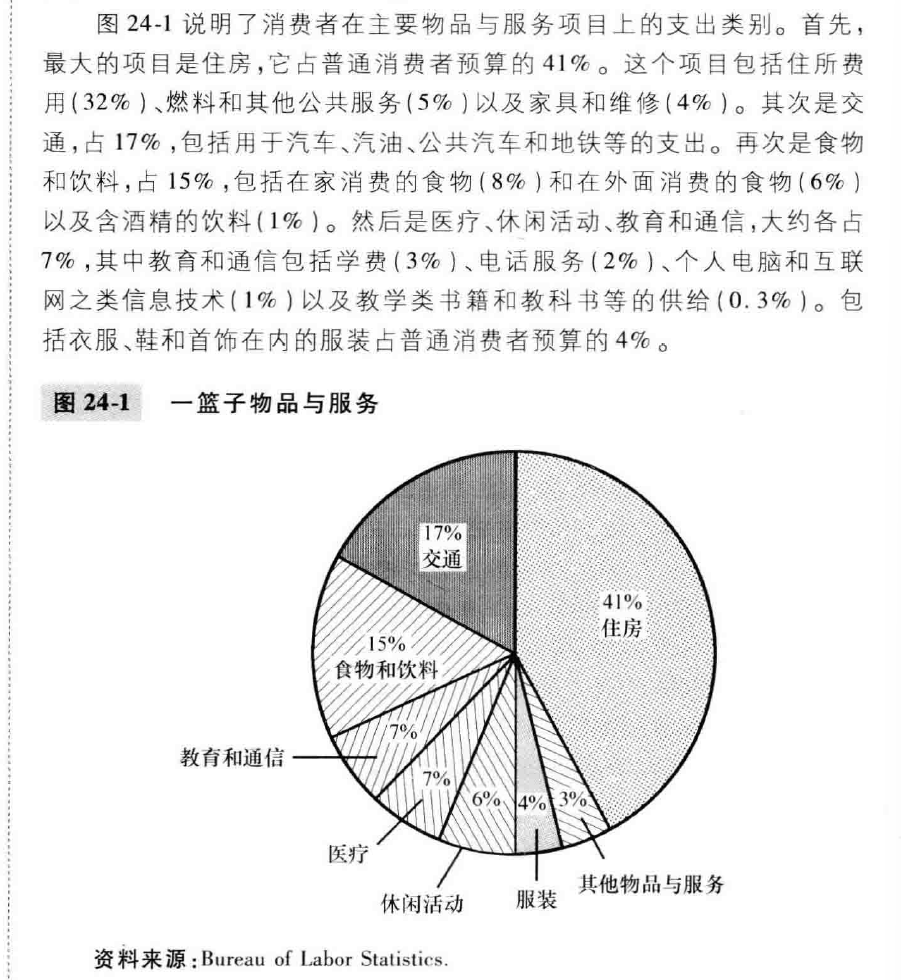
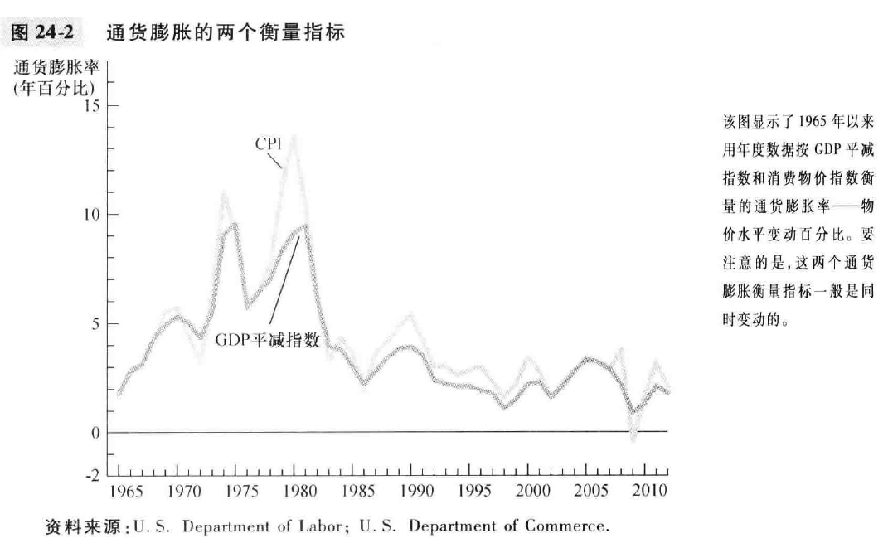
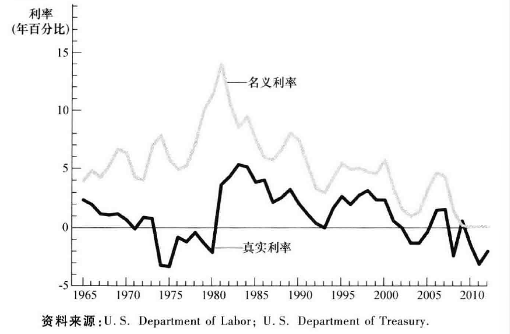

# chapter24-生活费用的衡量(page29-page43)

在上一章中, 我们考察了经济学家如何用国内生产总值(GDP)衡量一个经济所生产的物品与服务量. 本章要考察的是, 经济学家如何衡量整体生活费用. 为了比较若干年前的薪水与今天的新会, 我们需要找到一种把美元数字变成有意义的购买力衡量指标的方法. 这就是被称为 **消费物价指数** 的统计数字的工作. 

消费物价指数用来检测生活费用随着时间的推移而发生的变动. 当消费物价指数上升的时候, 一般家庭必须支出更多的钱才能维持同样的生活水平. 经济学用 **通货膨胀** 这个术语来描述物价总水平上升的状况. 

## 24.1 消费物价指数(CPI)

**消费物价指数(consumer price index, CPI)** 是普通消费者所购买的物品与服务的总费用的衡量指标. 我们要讨论如何计算消费物价指数, 以及这种衡量存在什么问题. 我们也要讨论, 如何比较消费物价指数与GDP平减指数. 

### 24.1.1 如何计算消费物价指数

下面给出劳工统计局所遵循的五个步骤:

1. 固定**篮子**: 确定哪些物价对普通消费者是最重要的. 如果普通消费者买的热狗比汉堡**数量要多**, 那么热狗的价格就比汉堡重要, 那么在衡量生活费用的时候就应该给热狗**更大的权重**. 

2. 找出价格: 对于需要比较的每个时点物品与服务的价格

3. 计算这一篮子东西的费用

4. 选择基年并计算指数:
   $$
   \text{消费物价指数} = \frac {\text{当年一篮子物品与服务的价格}} {基年一篮子的价格} \times 100
   $$

5. 计算通货膨胀率: 用消费物价指数计算通货膨胀率. **通货膨胀率(inflation rate)**是从前一个时期以来物价指数变动的百分比. 这就是说, 计算连续两年之间通货膨胀率的方法是:
   $$
   \text{第二年的通货膨胀率} = \frac {\text{第二年CPI}-\text{第一年CPI}} {\text{第一年CPI}} \times 100\%
   $$

一般来说, 美国的劳工统计局每月收集并整理成千上万种物品与服务的价格数据, 每月发布消费物价指数.

### 参考资料: CPI 的篮子里面有什么

除了CPI, 我们还计算 **生产物价指数(producer price index, PPI)**, 衡量的是企业而不是消费者所购买的一篮子物品与服务的费用. 由于企业最终要把它们的费用以更高消费价格的形式转移给消费者, **所以通常认为生产物价指数的变动是对预测消费物价指数的变动是有用的**. 

TODO: **所以通常认为生产物价指数的变动是对预测消费物价指数的变动是有用的**? 所以说两者应该呈现出一定的模仿效果? CPI 的趋势应该类似于延后的 PPI?? 有没有数据支撑或者实际的图表来看?? 延后多长时间??

### 24.1.2 衡量生活费用中的问题

CPI存在三个受到广泛承认但是难以解决的问题. 

第一个问题是**替代偏向**: 当价格年复一年的变动时, 并不都是同比例变动的, 一些物品的价格上升的比其他更快. 消费者对此的反应是少购买价格上升较快的物品, 多购买低价物品. 计算CPI的时候假设篮子里面的物品一定固定, 这就忽略了消费者替代的可能性, 从而高估了从某一年到下一年的生活费用的增加.

第二个问题是**新物品的引进**: 由于消费物价指数是基于固定不变的一篮子物品和服务的, 他就没有反映出来因为引进新物品而引起的美元价值的增加. 新物品的引进本身可能就带来了福利上升, 这个时候为了达到同样的福利水平, 要求的美元量应该是减少了. 

第三个问题是**无法衡量的质量变动**: 如果一种物品的质量逐年变差, 那么即使该物品的价格保持不变, 一美元的价值也下降了. 

许多政府计划是使用消费物价指数来调整物价总水平的变动的. 例如, 社会保障领取者每年的补助的增加就与消费物价指数相关. 

### 新闻摘录: 在网络时代监控通货膨胀

### 24.1.3 GDP平减指数与消费物价指数 (关系与差别)

**第一个差别是**: GDP平减指数反映 **国内生产** 的所有物品与服务的价格, 而消费物价指数反映 **消费者购买的** 所有物品与服务的价格. 
因此, 普通消费者买不到的消费品, 比如波音公司生产的一架飞机, 涨价了; 这将会体现在GDP平减指数里面, 但是不会体现在CPI里面; 
再比如, 进口汽车的价格上升了, GDP平减指数不变, 但是CPI就会上升;
当石油价格变动的时候, 石油产品在消费者支出中的比例远远大于GDP中的比例;

**第二个差别**: GDP平减指数和消费物价指数涉及对各种价格进行甲醛以得出一个物价总水平的数字. CPI比较的是 **固定的一篮子物品与服务的价格**, GDP平减指数比较的是 **现期生产的物品与服务的价格**, 

## 24.2 根据通货膨胀的影响校正经济变量

$$
\text{今年美元的数量} = T\text{年美元的数量} \times \frac {今天的物价水平} {T年的物价水平}
$$

### 参考资料: 使用通货膨胀校正电影数据

### 24.2.2 指数化

通货膨胀的**指数化(indexation)**: 根据法律或合同按照通货膨胀的影响对货币数量的自动调整; 

例如, 企业和工会之间的许多长期合同有工资根据消费物价指数部分或全部指数化的条款, 这种条款被称为 **生活费用津贴(cost-of-living allowance, COLA)**, 当CPI上升的时候, COLA自动增加工资. 

### 24.2.3 真实利率与名义利率

如果你储蓄到银行, 希望拿到本金和利率. 这个时候, **通货膨胀率越高, 购买力增加的越少.** 如果通货膨胀率大于利率, 购买力实际上就下降了. 

衡量美元数量变动的利率我们称为**名义利率(nominal interest rate)**, 根据通货膨胀校正的利率称为**真实利率(real interest rate)**;
$$
真实利率 = 名义利率 - 通货膨胀率
$$
