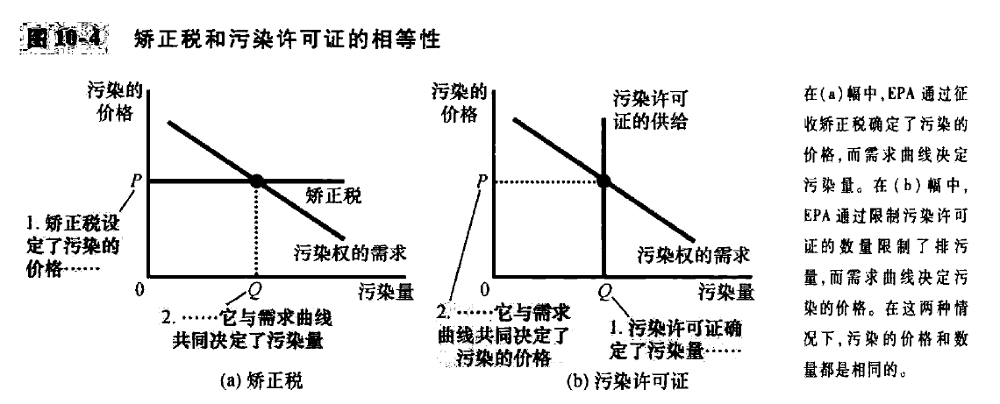

# Part4 公共部门经济学

# chapter10-外部性(page211-229)

本章的例子, 造纸的过程中会产生有毒的副产品 “二恶英”.

虽然我们知道, 经济学十大原理: **市场通常是一种组织经济活动的好方法**; 但是, 我们也要开始研究另一个原理: **政府行为有时可以改善市场结果**. 我们考察为什么市场有时不能有效的配置资源, 政府政策如何潜在的改善市场配置, 以及哪种政策有可能最好的发挥作用. 

本章所考察的市场失灵属于 **外部性** 的一般范畴之中. 当一个人从事一种 **影响旁观者福利**, 并且对这种影响没有付出或者得到报酬的活动时, 就产生了 **外部性**. 如果对于旁观者的影响是不利的, 那么就是负外部性, 否则就是正外部性. 

在存在外部性的时候, 买者和卖者都忽略了行为的外部效应, 所以这个时候市场均衡并不是有效的, **均衡没有实现整个社会总利益的最大化**. 

## 10.1 外部性和市场无效率

### **负外部性**

社会成本应该包括 **生产者的私人成本加上收到污染的不利影响的旁观者的成本**, 所以社会成本大于私人成本; 

不考虑负外部性的时候, 铝的均衡数量大于社会的最优量, 出现这种无效率是因为市场均衡仅仅反映了生产的社会成本;
社会计划者如何达到这种最优结果? 一种方法是对铝生产者销售的每吨铝征税, 税收使得铝的供给曲线向上移动, 移动量就是税收规模. 如果税收准确的反映了外部成本, 新的供给曲线就与社会成本曲线相重合. 

**这种税的运用被称为外部性内在化, 因为它激励市场买者与卖者考虑其行为的外部影响**, 这种政策也体现出来, 经济学十大原理质疑: 人们会对激励做出反应. 

### 正外部性

有一些活动给第三方带来了利益, 比如考虑**教育**: 在很大程度上, 教育的利益是**私人的**, 教育的消费者成为生产率高的工人, 从而以高工资的形式获得大部分利益; 
**对于每个人来说:** 受教育更多的人会称为更理智的选民, 这意味着更好的政府 -> 每个人受益; 
受教育更多的人意味着更低的犯罪率; 
受教育更多的人可以促进技术进步的开发和扩散, 给每个人带来更高的生产率和更高的工资;

当物品存在正外部性的时候, **需求曲线没有完全反应一种物品的社会价值**, 社会价值大于私人价值, 所以社会价值曲线在需求曲线的上面. 在社会价值曲线和供给曲线相交之处得出了最优量. 因此, 社会最优量大于私人市场决定的数量. 

同样的, 政府可以通过使市场参与者把外部性内在化来纠正市场失灵. 此时需要对正外部性进行补贴, 二者正是政府所遵循的政策: 通过公立学校和政府助学金来补贴教育. 

### 新闻摘录: 乡村生活的外部性

统计数据可以得出, 乡村生活比城市生活的碳排放量更大. 城市生活交通距离短, 家庭取暖的碳排放量更少; 城市化并不等同于环保的对立面, 相反, 恰当的城市化就是在环保. 

### 案例研究: 技术溢出,产业政策和专利保护

技术溢出是一种重要的正外部性, 一个企业的研究和生产对其他企业接触技术进步也会有正向影响. 
这种情况下, 政府可以通过补贴生产, 比如“机器人”生产来把外部性内在化. 但是这里需要考虑的关键因素是, 技术溢出效应有多大, 这是难以计算的.

一些经济学家认为, 技术溢出效应是普遍存在的, 政府应该鼓励那些产生最大溢出效应的行业, 比如芯片. 比如, **美国税法通过对研发支出提供特别税收减免, 进行有限的鼓励**. 还有国家针对特定行业进行补贴, 这有时候成为**产业政策**

对待技术溢出的另一种方法是 **专利保护**. 专利法赋予发明者在一定时期内对其发明物的专有使用权而保护发明者的权利. 企业可以申请专利, 并自己真有大部分经济利益. 专利通过赋予**企业对其发明物的产权**来使得外部性内在化. 因为, 如果其他企业想要使用这项新技术, 必须得到发明企业的允许并向该企业支付专利使用费, 这就是对企业研究的激励. 

## 10.2 针对外部性的公共政策

政府的解决方法, 一般可以分成两种: **命令与控制政策**直接对行为进行管制, **以市场为基础**的政策提供**激励**. 

### 命令与控制政策: 管制

社会不是要完全消除污染, 而是要权衡成本与利益, 以便决定允许哪种污染以及允许多少污染. 在美国, 环境保护署(EPA)就是一个提出并实施旨在保护环境的管制的政府机构. 

### 市场1: 矫正税与补贴

我们可以对比管制和矫正税: EPA让每个工厂年排污量限制在300吨 vs EPA 对每吨废物征收 x 元的税收. 

1. 税收和管制同样有效, 当税收足够高, 工厂就会关闭
2. 税收规定了污染权的价格, 如果造纸厂减少污染的成本比钢铁厂低, 造纸厂对于税收的反应是大幅度减少污染, 从而少交税; 钢铁厂的反应是小幅度减少污染, 多交税;
   因为税收规定了污染权的价格, 市场通过这个价格达到最优配置
3. 矫正税激励工厂开发更环保的技术
4. 增加政府收入

### 案例研究: 为什么对汽油征收的税如此之重

三种负相关性:

1. 拥堵
2. 车祸
3. 污染

### 市场2: 可交易的污染许可证 (巧妙)

实际上, 矫正税和污染许可证是非常相似的, 我们可以考察两幅图, 污染的需求曲线和污染的供给曲线:

另外, 在某些情况下, 出售污染许可证可能比实行矫正税更好, 因为 EPA 可能希望倒入河流的总污染不超出600吨, 但是不知道需求曲线, 这个时候就可以拍卖600吨的污染许可证, 拍卖价格就是矫正税的适当规模. 

拍卖污染权已经成为一个重要的方法, 被认为是一种低成本, 高效率的保护环境的方法. 

### 新闻摘录: 应对气候变化, 我们应该做什么 (关于碳税)

在加拿大的不列颠哥伦比亚省, 每吨二氧化碳25美元涨到30美元, 这使得污染更加昂贵.
同时, 碳税用来减少每个人和每个企业的税收. 

### 对关于污染的经济分析的批评

## 10.3 外部性的私人解决方法

有时外部性问题可以使用道德规范和社会约束来解决, 
“己所不欲, 勿施于人” 约等于 要将自己行为的外部性内在化;

另一种外部性的私人解决方法是慈善行为;

私人市场往往可以通过依靠有关各方的利己来解决外部性问题, 有时这种解决方法采取了把不同类型的经营整合在一起的形式. 
例如, 考虑一个苹果园主和一个养蜂人, 两个人的经营都给对方带来了正外部性, 蜜蜂的存在有助于果实, 苹果开花的存在有助于蜜蜂的生存; 但是, 苹果园主做出决策的时候, 并不会考虑到蜜蜂的情况, 所以这是一种 **外部性**. 但是, 当同一个企业内进行这两种活动, 那么这个企业可以选择最优的苹果树数量和蜜蜂数量. **外部性内在化是某些企业进行多种类型经营的一个原因**

在私人市场, 另一种解决外部效应的方法是利益各方签订合约, 使得双方的情况都变好

### 科斯定理

**科斯定理: 认为如果私人各方可以无成本地就资源配置进行协商, 那么, 他们就可以自己解决外部性问题的观点.**

Dick 养狗, Jane 不能接受狗的叫声. 法律赋予养狗的权利, 但是 Jane 可以付一笔钱让Dick不去养狗 / 法律赋予享受安静的权利, 但是 Dick 可以付一笔钱让 Jane 忍受狗的叫声. (无论最初的权利如何分配)

科斯定理说明: 私人经济主体可以解决他们之间的外部性问题, **无论最初的权利如何分配, 有关各方总是可以达成一种协议**. 在这种协议中, 每个人的状况都可以变好, 而且结果是有效率的. 

### 为什么私人方法并不总是有效

有可能存在**交易成本**的问题, 比如 Dick 和 Jane 讲述不同的语言, 这个时候就需要一个翻译, 这个翻译的存在带来了成本;

当利益各方人数众多的时候, 达成有效率的协议尤其困难, 因为协调每个人的成本太高. 这个时候, 政府就可以发挥作用. 

