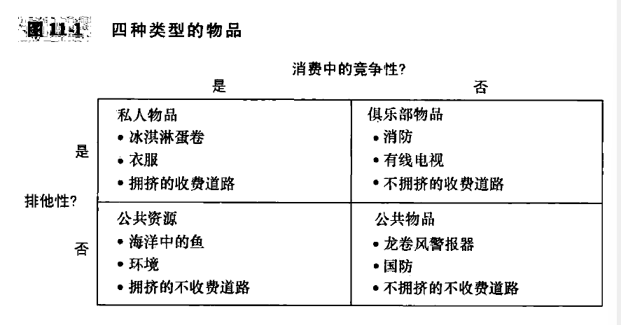

# chapter11-公共物品和公共资源(page233-247)

有一些**免费的物品**, 比如运动场, 公园和节庆游行, **都是政府提供的**.

没有价格的物品向经济分析提出了特殊的挑战, 在我们的经济中, **大部分物品都是在市场中配置的**, 价格是引导买者和卖者决策的信号, 这些决策会带来有效的资源配置. 但是, 当一些物品可以免费得到的时候, 价格这种市场力量就不存在了. 

下面, 我们将会考察, 当存在没有市场价格的物品时, 所产生的资源配置问题, 这里也会说明经济学十大原理之一: **政府有时可以改善市场结果**

## 11.1 不同类型的物品

在考虑经济中的各种物品时, 根据两个特点来对其进行分类是有用的:

1. 该物品具有**排他性**吗? 也就是说, 可以阻止人们使用这些物品吗; 一种物品具有的可以阻止一个人使用该物品的特性, 比如海洋中的鱼你是没有办法组织别人使用的..
2. 该物品有**消费中的竞争性**吗? 也就是说, 一个人使用某种物品会减少其他人对该物品的使用吗

1. **私人物品**, 既有排他性又有消费中的竞争性; 比如冰淇淋蛋卷, 不卖给一个人就可以排他, A买了就影响了B买冰淇淋
2. **公共物品**, 既无排他性, 又无消费中的竞争性; 比如龙卷风报警器, 小镇上的所有人都可以听到警报, 所以并不排他; A的使用没有影响到B, 所以是没有竞争性; 
3. **公共资源**, 具有消费中的竞争性, 但是没有排他性; 比如海洋中的鱼, 你不能让渔民不去捕鱼; 但是你捕鱼更多, 留给别人的就会更少
4. **俱乐部物品**, 具有消费中的竞争性, 但是没有排他性; 比如消防, 消防部门袖手旁观就可以让别人不能使用; 但是一旦政府为消防部门付钱, 那么多保护一所房子的成本是微不足道的. (**这是自然垄断的一种类型**)

在本章中, 我们考察没有**排他性的物品: 公共物品和公共资源**. 由于没有排他性, 所以任何人都可以免费得到他们. 另外, 这些物品都只有**外部性**, 因为他们本身是没有价格的. 

## 11.2 公共物品

**搭便车者问题: 得到一种物品的利益但是避免为此付费的人.**

考虑一场焰火表演, 小镇共有500人, 每个人对于观看表演的评价是10美元, 总利益是 5000 美元, 焰火表演的成本是1000美元. 因为总利益大于总成本, 所以在这一天举办焰火表演是有效率的. 

但是, 私人市场可以提供这种有效率的结果吗? 比如说, 企业家决定收门票, 每个人5美元, 问题是: 人们就算不买票, 也可以观看焰火表演(因为公共物品不具有排他性), 这些人就是搭便车者. 

尽管私人市场不能提供, 但是如果是小镇政府, 征收适当的税务, 那么就可以达到有效率的结果. 

### 一些重要的公共物品

1. 国防
2. 基础研究(与专利知识很不相同), 一般性知识, 
3. 反贫困: 反贫困的计划者生成, 反贫困是一种公共物品, 穷人的状况变好是因为他们生活水平提高, 纳税人的状况变好是因为他们生活在一个贫困较少的社会中;

### 案例研究: 灯塔是公共物品吗

可以是公共物品, 也可以是私人物品: 
一些灯塔私人拥有并且经营, 并且向附近港口的所有者收费. 

### 成本-收益分析的难题

政府需要公共物品的社会成本和社会收益的研究, 然后才可以进行决策

### 案例研究: 一条生命值多少钱

通过观察人们自愿冒的危险以及需要给一个人多少钱他才愿意去冒这个风险. 比如, 不同职业的死亡风险不同, 经济学家可以一定程度上得出人们对自己生命的评价. 用这种方法研究得出的结论是, 一个人生命的价值约为 1000万美元. 

## 11.3 公共资源

公共资源没有排他性, 但是在消费中有竞争性, 一个人的使用减少了其他人对他的享用.

### 公地悲剧

镇周围的草地归所有居民所有, 称为镇公地. 所有人都放羊, 而且放羊越来越多, 以至于草地被破坏, 羊群也不复存在. 

公地悲剧的产生是因为外部性. 当一个家庭的羊群在公地上吃草的时候, 他就降低了其他家庭可以得到的土地质量. 由于人们在决定自己养多少羊的时候并不考虑这种负外部性, 就会导致问题. 

**公地悲剧得出了结论: 当一个人使用公共资源时, 他就减少了其他人对这种资源的享用. 由于这种负外部性, 公共资源往往被过度使用.** 政府可以通过管制或者税收来减少公共资源的消耗从而解决这个问题, 也可以把公共资源变成私人物品. 

### 一些重要的公共资源

1. 清洁的空气和水
2. 拥堵的道路
3. 鱼, 鲸, 和其他野生动物

### 新闻摘录: 收费公路案例

为了解决拥堵道路问题, 收费是一个很好的办法. 最好的解决方案是根据目前交通状况实时调整收费. 

### 案例研究: 为什么奶牛没有绝种

大象和奶牛都有商业价值, 大象被过度猎杀, 但是奶牛却不会绝种?

大象是公共资源, 奶牛是私人物品, 我们知道, 公共资源往往被过分使用.

为了解决大象的问题, 有些地方使用私有制方法, 允许人们捕杀大象, 但是只能捕杀自己所有的大象. 

## 11.4 结论: 产权的重要性

市场没有有效地配置资源, 是因为没有很好的**建立产权**. 这就是说, 某些有价值的东西并没有在法律上有权控制它的所有者. 

当产权缺失引起市场失灵的时候, 政府可以潜在的解决这个问题. 例如出售污染许可证的时候, 政府帮助界定产权, 从而释放市场的力量. 政府可以对私人行为进行管制. 还有政府提供市场不能提供的物品, 比如国防. 这些方案可以使资源配置更有效率, 从而增进经济福利. 
