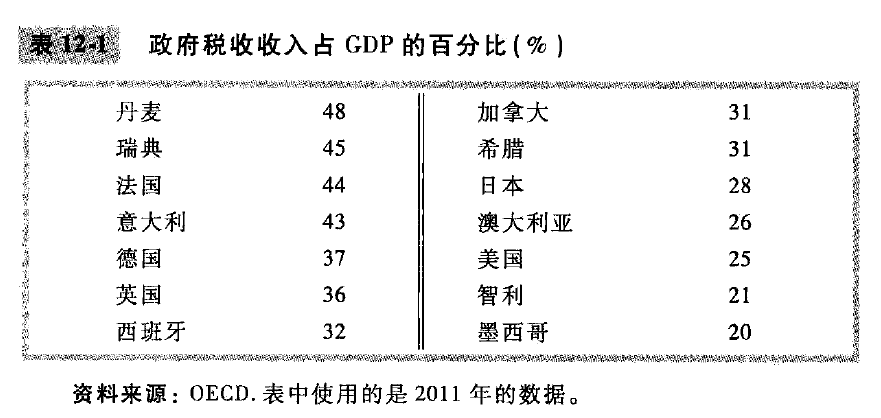
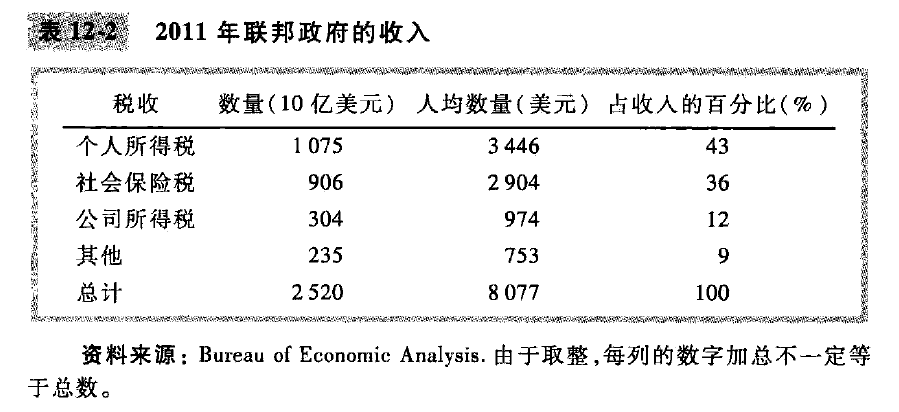
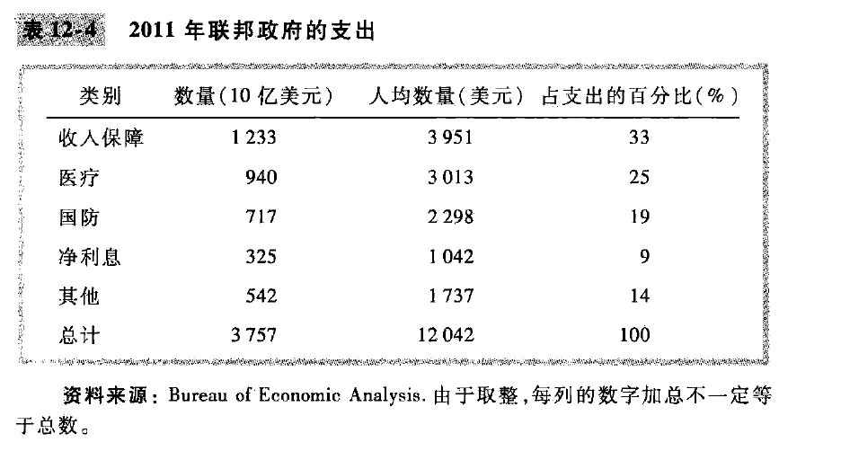
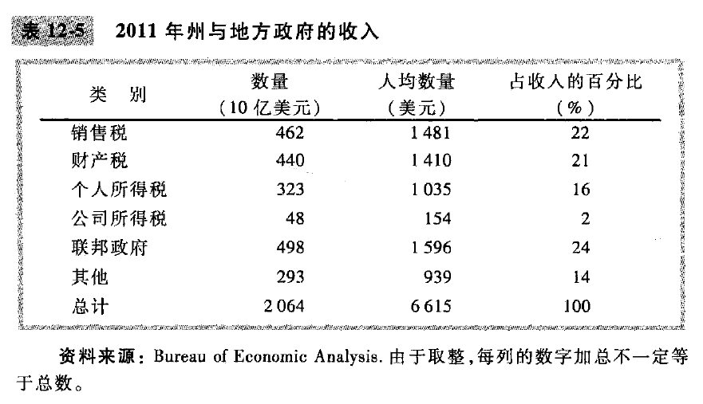
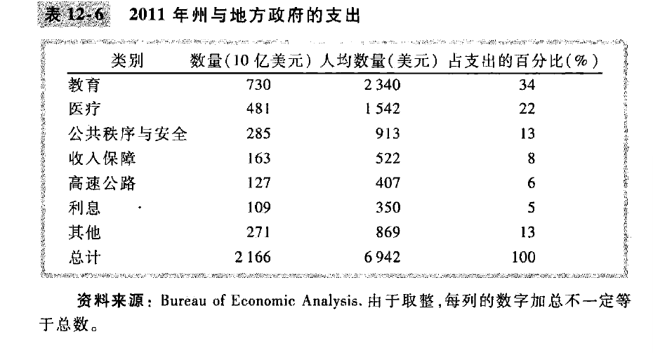

# chapter12-税制的设计(page251-270)

在20世纪期间, 普通美国人所有的税收加在一起, 包括**个人所得税, 公司所得税, 工薪税, 销售税, 财产税**, 总计超过一个普通美国人收入的**1/4**, 在一些欧洲国家, 税收甚至比这还要高.

## 12.1 美国政府的财政概况

在1902年, 政府收入占总收入中的7%, 但到2011年, 政府收入约占到总收入的**30%.** 这也表示, 政府在美国经济中起着重要作用, 而且其作用在不断加强. 

一些发达国家的税收规模更大, 这些税收为更为慷慨的社会保障网筹资, 包括对穷人和失业者提供更多的收入支持, 以及扩大政府提供的医疗保障的覆盖范围. 

为了更全面的了解美国政府财政状况, 我们把总量分解为几个大类

### 1. 联邦政府

这里会发现, 总支出比总收入多了1万亿美元, 这种情况称为预算赤字, 政府通过发债来为预算赤字筹资

### 案例研究: 未来的财政挑战

**政府支出增加**的一个原因是, 社会保障和医疗保障向老年人提供了大量利益. 
老年人在整个人口中所占的比重越来越大. 

**老龄化意味着什么? 政府的财政收入和财政支出变化问题??**

对于美国来说, 1950年, 老年人口约为工作年龄人口的14%, 2010年左右, 老年人口约为工作年龄人口的21%, 2050年左右, 老年人口预计约为工作年龄人口的 40%.

1个老年人对应7个工作年龄人口 vs 1个老年人对应2.5个工作年龄人口.

### 2. 州与地方政府

## 12.2 税收和效率

当选择不同的税制方案的时候, 两个目标: **效率和平等**.

如果一种税制用**对纳税人来说较低的成本**筹集到等量收入, 那么就比另一种更有效率:

- 税收扭曲了人们的决策时引起的无谓损失
- 纳税人遵照税法时承担的管理负担

总的来说, 就是需要减少无谓损失和管理负担.

### 1. 无谓损失

### 案例研究: 应该对收入征税, 还是应该对消费征税

个人所得税的一些问题, 一个是这种税不鼓励人们像没有税收时那样**勤奋工作**, 这种税引起的另一种无效率是它**不鼓励人们进行储蓄**.
一个25岁的人如果储蓄1000美元, 每年利息是8%; 但是如果考虑到对于利息征税1/4, 那么就变成6%的有效利率. 

目前美国税法的一些条款已经像是消费税, 纳税人可以投入到特殊储蓄账户, 比如个人退休账户和401k计划, 在退休时支取之前和它赚到的累计利息可以不用纳税. 

### 2. 管理负担

### 3. 边际税率和平均税率

如果我们想要衡量税制在多大程度上扭曲了激励, 边际税率就会更有意义; 决定所得税无谓损失的是边际税率

### 4. 定额税

定额税可能是最有效率的税, 因为没有影响到任何决策, 同时减少了管理负担. 但是, 对于富人和穷人一样的税制, 这是公平的吗? 

## 12.3 税收与平等

### 1. 受益原则

税收的第一个原则被称为受益原则. 他认为人们应该根据他们从政府服务中得到的利益来纳税. 

在一些州, 汽油税的收入用于修建和维护公路, 这符合受益原则.

受益原则支持, 富人应该更多纳税, 因为富人从公共服务中受益更多.

### 2. 支付能力原则

