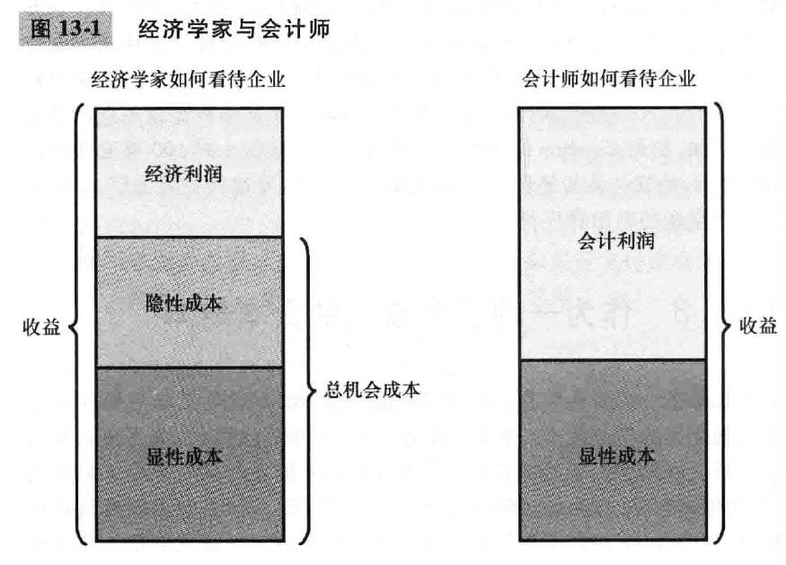
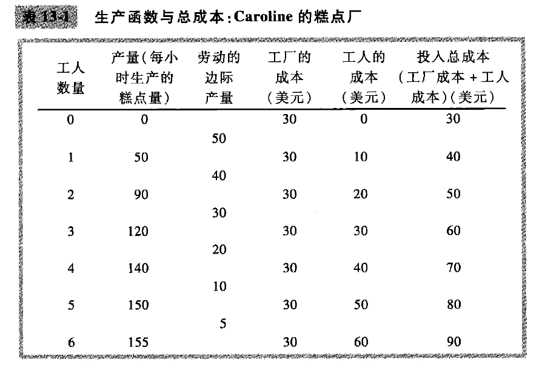
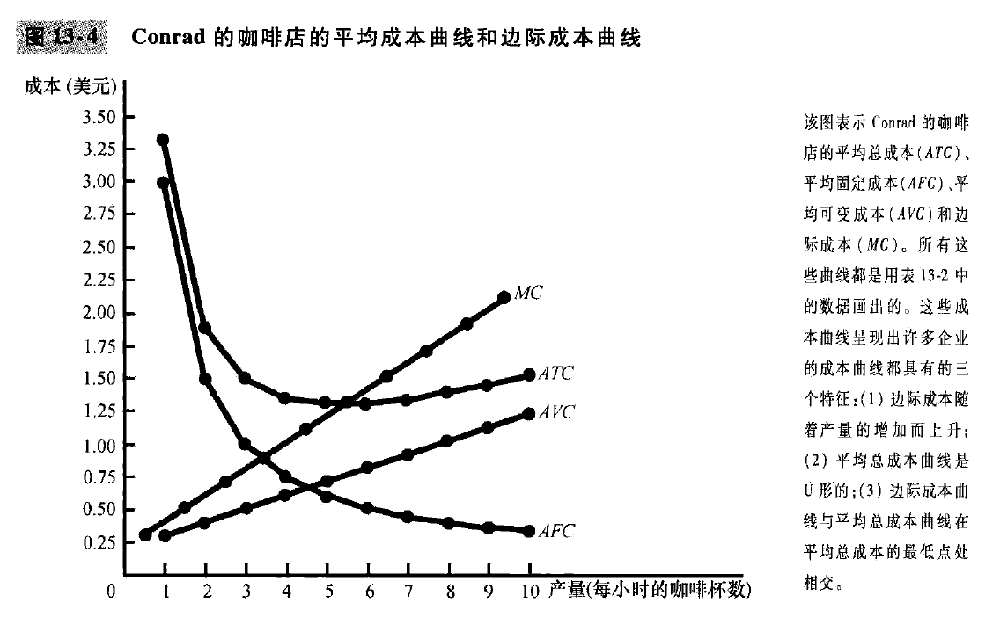
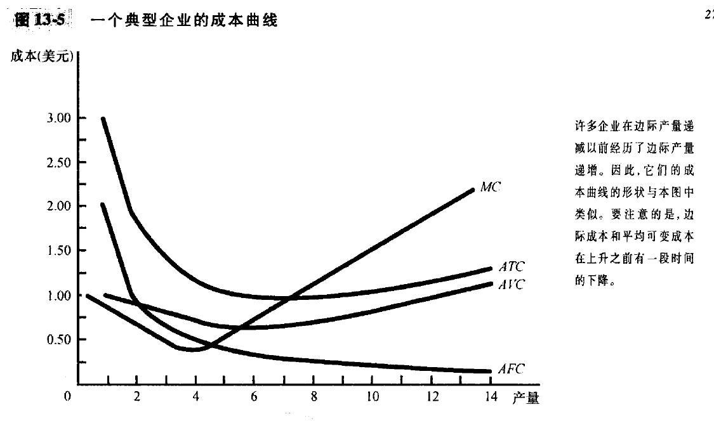

# 第5篇: 企业行为与产业组织

# chapter13-生产成本(page277-293)

我们下面, 将会更详细的考察企业行为, 以及**产业组织**这一部分内容. 产业组织研究企业有关价格和数量的决策如何取决于他们所面临的市场条件. 比如说, 你所在的城镇里可能有几家披萨店, 但是只有一家电视公司, 这个时候的问题是: **企业的数量如何影响一个市场的价格以及市场结果的效率?**

## 13.1 什么是成本

**总收益: total revenue; 总成本: total cost; 利润: profit**;

$利润 = 总收益 - 总成本$

一般来说, 企业的目标是利润最大化. 

### 作为机会成本的成本

我们回忆经济学十大原理之一: 某种东西的成本是你为了得到它所放弃的东西. 

企业的机会成本大概可以分成**显性成本(需要企业指出货币的投入成本)**和**隐性成本(不需要企业支出货币的投入成本)**. 比如说 Caro 使用1000美元来支付工资, 这种机会成本就是显性成本; 但是比如Caro本身精通电脑, 作为程序员时薪100美元, 但是一旦Caro选择在糕点厂工作1个小时, 那么就放弃了100美元的收入, 这是隐性成本. **Caro经营的总成本是显性成本和隐性成本之和**

### 作为一种机会成本的资本成本

几乎每一个企业都有一项重要的隐性成本, 那就是已经投资于企业的金融资本的机会成本. 
假定Caro用储蓄的30万美元从一个人手里买下来糕点厂, 如果Caro存入利率为5%的储蓄账户, 那么她每年都会赚到1.5万美元. 为了糕点厂, Caro的企业的隐性成本包括了1.5万美元.
再假定, Caro手里没有30万美元, 而是只有10万美元, 并且以5%的利率从银行借了20万美元, 这个时候每年为银行贷款支付的是1万美元利息, 这是显性成本(因为这是从企业流出的货币量), 但是如果加上放弃的储蓄利息(隐性成本5000美元), 那么拥有企业的机会成本仍然是**1.5万美元**.

### 经济利润与会计利润

## 13.2 生产与成本

在下面的分析中, 我们简化假设: Caro 工厂的规模是固定的, Caro只能通过改变工人数量来改变生产的糕点量. 这种假设短期内是现实的, 但是长期不现实. 

### 生产函数

横轴是投入量, 纵轴是产量, 投入量与产量之间的关系称为生产函数(production function). 

经济学十大原理之一是: 理性人考虑边际量. 这个思想是理解企业决定雇用多少工人和生产多少产量的关键. 

生产过程中任何一种投入的**边际产量**, 是增加一单位投入引起的产量增加. 当工人数量从1增加到2的时候, 产量从50变成90, 所以第二个工人的边际产量是40.
要注意的是, **随着工人数量的增加, 工人的边际产量减少, 这个特征被称为边际产量递减.**

## 13.3 成本的各种衡量指标

Conrad 咖啡店举例.

成本可以分成两类: 一些成本不随着产量的变动而变动, **这是固定成本**, 固定成本是即使不生产也要发生的成本; **可变成本**随着企业产量变动而变动. 
### 平均成本与边际成本

在企业决定生产多少的时候, 这种决策的关键是, 成本如何随着产量水平的变动而变动. 
**多生产一杯咖啡需要多少成本? vs 生产普通的一杯咖啡需要多少成本?**

我们确实可以算出, 平均总成本, 平均固定成本, 平均可变成本; 但是我们需要**边际成本(marginal cost)**, 表示企业增加一单位产量时成本的增加量.
$$
平均总成本=总成本/产量 \\
ATC=TC / Q \\
边际成本 = 总成本变动量 / 产量变动量 \\
MC = \Delta TC / \Delta Q
$$

### 成本曲线及其形状

**递增的边际成本:**

**U形平均总成本:** 平均总成本=平均固定成本+平均可变成本; 平均固定成本随着产量的增加而下降, 平均可变成本一般随着产量的增加而增加. U型曲线的底端对应着使平均总成本最小的产量, 这种产量有时被称为企业的**有效规模(efficient scale)**; 

**边际成本和平均总成本之间的关系**: 只要边际成本小于平均总成本, 平均总成本就下降; 只要边际成本大于平均总成本, 平均总成本就上升; 以及, **边际成本曲线与平均总成本曲线在平均总成本曲线的最低处相交**

### 一个典型企业的成本曲线

## 13.4 短期成本与长期成本

## 13.5 结论