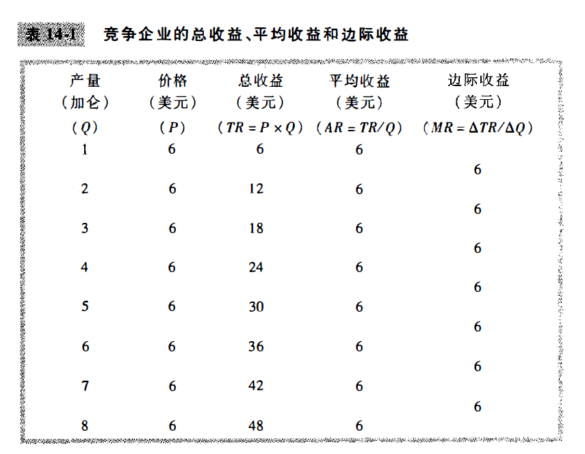
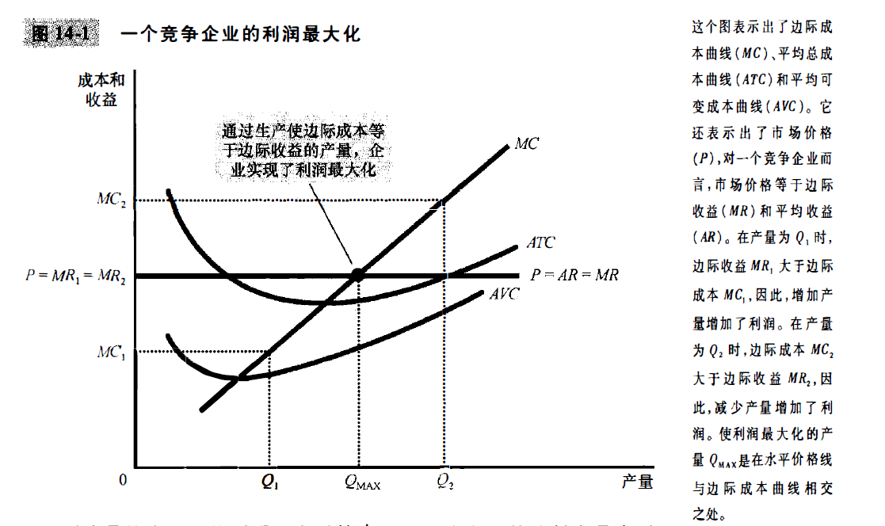
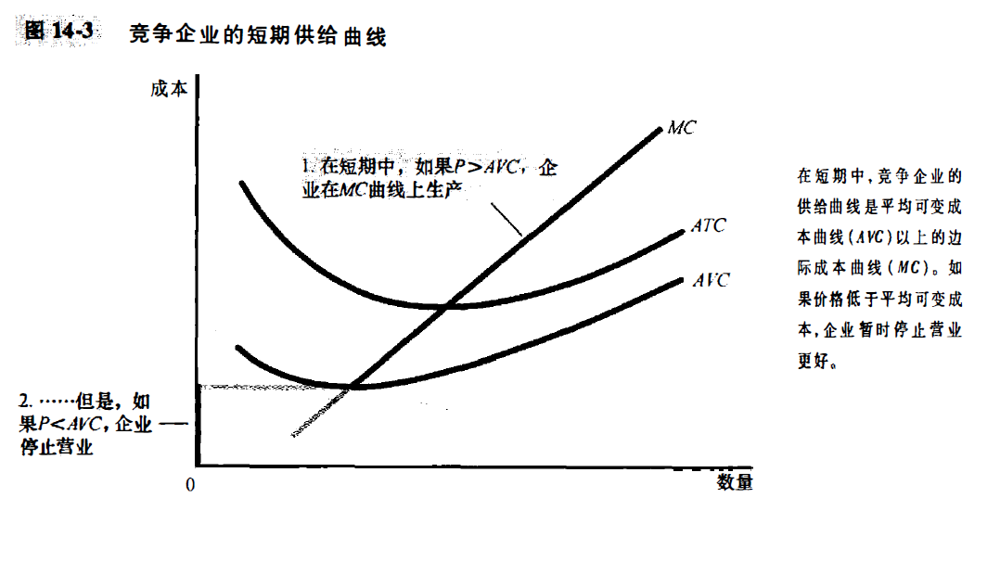
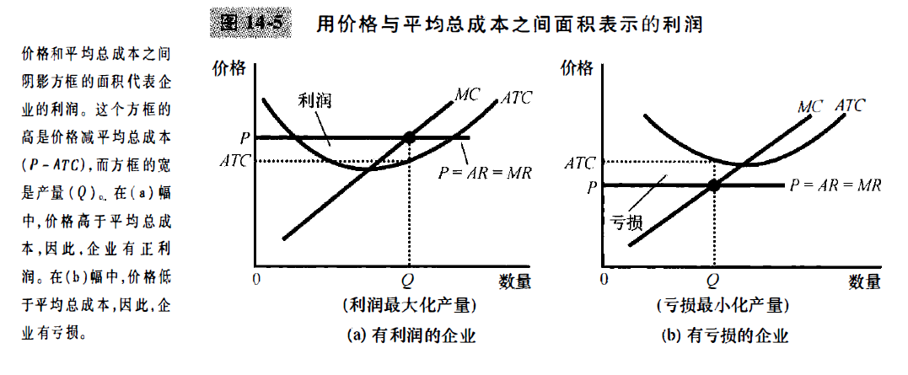
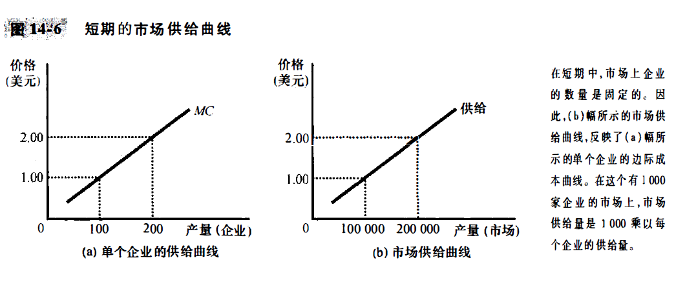
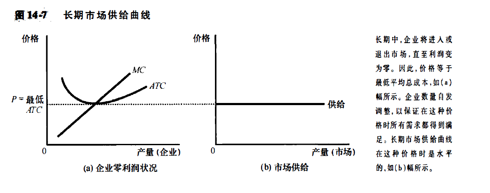

# chapter14-竞争市场上的企业(page298-314)

1. TODO: 忽然想到, 平台经济学, 在今天应该是一个重要的话题, 相关立法的跟进目前来说如何. 
2. TODO: 品牌问题, 一个品牌的商品价格会随便改变吗? 
3. TODO: 对于服务业来说, 是不是有特殊性? 服务量vs可以服务量, 我们的产品是有剩余的? 的问题..不能通过价格达到均衡?
   1. [服务经济学 - MBA智库百科](https://wiki.mbalib.com/wiki/服务经济学)

如果某个加油站将汽油价格提高20%, 那么大家就会去别的加油站购买汽油; 但是如果当地的自来水公司将水价格提高20%, 人们的用水量却不会忽然大幅度减少, 并且找不到另一个供给者, 所以自来水公司的销售量变化很小. 

回忆我们关于竞争的定义: 如果每个买者和卖者与市场规模相比都微不足道, 从而没有什么能力影响市场价格, 那么该市场就是竞争性的. 与此相反, 如果一个企业可以影响他出售的商品的市场价格, 我们就说该企业有 **市场势力**

## 14.1 什么是竞争市场

### 竞争的含义

**完全竞争市场的特征:**

1. 市场上有许多买者和卖者
2. 各个卖者提供的物品大体上是相同的
3. 企业可以自由的进入或退出市场(这个条件对于企业成为价格接受者并不是必要的, 但是如果允许自由进入和退出, 这就是一种影响**长期均衡**的强大力量)

### 竞争企业的收益

竞争市场上的企业的目标, 是努力使利润(总收益减去总成本)最大化. 

下面我们考虑一个特定企业, Vaca家庭牛奶厂.
假设Vaca牛奶厂生产的牛奶量是Q, 并以**市场价格**P出售每单位牛奶, 那么收益就是 $P*Q$. 而且, 因为Vaca无论生产多少, 市场价格都是不变的, 所以我们可以得出, **总收益与产量同比例变动**

我们会发现, 平均收益是总收益($P*Q$)除以产量($Q$), 因此, **对所有企业而言, 平均收益等于物品的价格**. 
对于竞争企业来说, 总收益是 $P*Q$, 而且$P$是固定不变的, 因为是市场价格. 我们得出, **对竞争企业而言, 边际收益等于物品的价格**

## 14.2 利润最大化与竞争企业的供给曲线

前面, 我们已经讨论了企业的成本, 以及竞争企业的收益. 那么接下来, **我们就可以考察一个竞争企业如何使得利润最大化, 以及这种决策如何决定了其供给曲线.**

### 1. 一个简单的利润最大化例子

根据经济学十大原理之一, 理性人考虑边际量. 如果边际收益大于边际成本, 那么企业就应该增加产量, 因为这个时候装入口袋的货币大于从口袋里面拿出来的货币. 如果我们考虑边际量, 并且对产量水平进行调整, 就会自然生产使利润最大化的产量.

### 2. 边际成本曲线和企业的供给决策

对于一个竞争企业来说, $P=AR=MR$, 市场价格等于平均收益等于边际收益. 
试想, 我们的产量一开始是$Q_1$, 这个时候边际收益曲线在边际成本曲线的上面, 观察 (MR1 与 MC1), 这个时候, 企业增加产量, 必然会提高利润. 对于$Q_2$来说同理.

那么对产量的边际调整到哪一点最合适? 

- **如果边际收益大于边际成本, 那么企业应该增加其产量**
- **在利润最大化的产量水平时, 边际收益和边际成本正好相等.** 

**另外, 在本质上, 因为企业的边际成本曲线决定了企业在任何一种价格时愿意供给的物品数量, 因此, 边际成本曲线也是竞争企业的供给曲线(一部分).**

### 3. 企业的短期停止营业决策

我们下面讨论, 在什么情况下, 企业决定停止营业, 并根本不生产任何东西. 
这里, 我们需要区分一下企业暂时停止营业和企业永久性的退出市场. 停止营业是短期决策, 退出是指长期决策, **短期中不能避开固定成本, 但是在长期中可以避开固定成本.**

另外, 我们将固定成本称为一种**沉没成本**. 比如一个季节中, 无论农民是不是决定要种下农作物, 买土地的钱都花出去了, 这就是沉没成本. 

那么是什么决定了企业的停止营业决策. 如果企业停止营业, 它就失去了出售自己产品的**全部收益**. 同时, 它节省了生产其产品的可变成本(但仍需支付固定成本). 因此, **如果生产能得到的收益小于生产的可变成本, 企业就停止营业. 或者说, 如果物品的价格小于企业的平均可变成本, 那么企业就会停止营业**
这也是直观的, 因为在选择是否生产时, 企业会比较普通的一单位产品所得到的价格和生产这一单位产品的平均可变成本. 如果价格没有弥补平均可变成本, 那么生产越多损失越多. 否则, 生产变多损失变少, (这时候尽管有可能是亏损状态, 因为还有固定成本, 但是这个时候的生产却带来了亏损的减少)

现在我们全面描述竞争企业的利润最大化策略. 如果企业生产某种物品, 那么, 它将生产使边际成本等于物品价格的产量, 这一物品价格对于企业来说是既定的. 但如果价格低于该产量时的平均可变成本, 则企业暂时停止营业并什么也不生产会使其状况更好一些. 下图说明了这些结论. 
**竞争企业的<u>短期供给曲线</u>是边际成本曲线位于平均可变成本曲线之上的那一部分.**

### 覆水难收与其他沉没成本

### 4. 企业退出或进入一个市场的长期决策

企业退出一个市场的长期决策与停止营业决策相似. 如果企业退出, 它将失去它从出售产品中得到的全部收益. 但它现在不仅节省了生产的可变成本, 而且节省了**固定成本**. 因此, **如果从生产中得到的收益小于它的总成本, 企业就应该退出市场.**

通过数学公式表达, $TR$ 表示总收益, $TC$ 表示总成本, 企业的退出标准可以写成 
$$
\text{if }TR < TC, \text{then exit}
$$
如果两边同时除以产量, 总收益/产量就是 价格, 总成本/产量就是 平均总成本ATC, 所以企业的退出标准就是:
$$
\text{if  } P < ATC, \text{then  exit} 
$$
反过来也是成立的, 如果价格高于平均总成本ATC, 那么就选择进入. 

由此我们可以说明竞争企业的长期利润最大化策略: **如果企业生产某种物品, 它将生产使得“边际成本=物品价格”的产量. 但是如果价格低于该产量时的平均总成本, 企业就会选择退出市场. 所以说, 竞争企业的长期供给曲线是边际成本曲线位于平均总成本曲线上面的那一部分.**

### 5. 用竞争企业图形来衡量利润

## 14.3 竞争市场的供给曲线

前面, 我们考察单个企业的供给决策, 现在来讨论市场的供给曲线. 我们考察两种情况, 第一, 考察有固定数量企业的市场, 第二, 考察企业数量会随着老企业退出和新企业进入变动的市场. 这分别会对应短期和长期的市场情况. 

### 1. 短期: 有固定数量企业的市场供给

### 2. 长期: 有进入和退出的市场供给

TODO: 这个假设是不是有点太强了...

零利润?

### 3. 如果竞争企业利润为0, 为什么他们要留在市场上

### 4. 短期与长期内的需求移动

### 5. 为什么长期供给曲线可能向右上方倾斜(前面假设得出的结论是完全弹性的供给曲线, 但是事实往往并非如此)

原因1: 用于生产的资源可能是有限的. 例如农产品市场, 每一个人都可以购买土地从事农业, 但是土地的数量是有限的. 

原因2: 不同企业可能有不同的成本. 比如油漆工市场, 有的人从事工作的成本低, 有的人成本高. 成本低的人更容易留在市场, 如果需要吸引那些成本高的人进入, 就需要提高价格. 当然, 这时候那些成本低的人就会有利可图.

注意, **如果企业有不同的成本, 一些企业在长期中也能盈利**. 在这种情况下, 市场价格代表边际企业(如果价格有任何下降就退出市场的企业的平均总成本). **边际企业赚到零成本, 但是成本更低的企业赚到正利润**.

**由于企业在长期中比在短期中更容易进入和退出, 所以长期供给曲线一般比短期供给曲线更富有弹性**

## 14.4 结论
