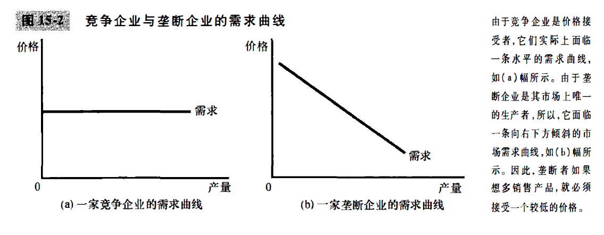
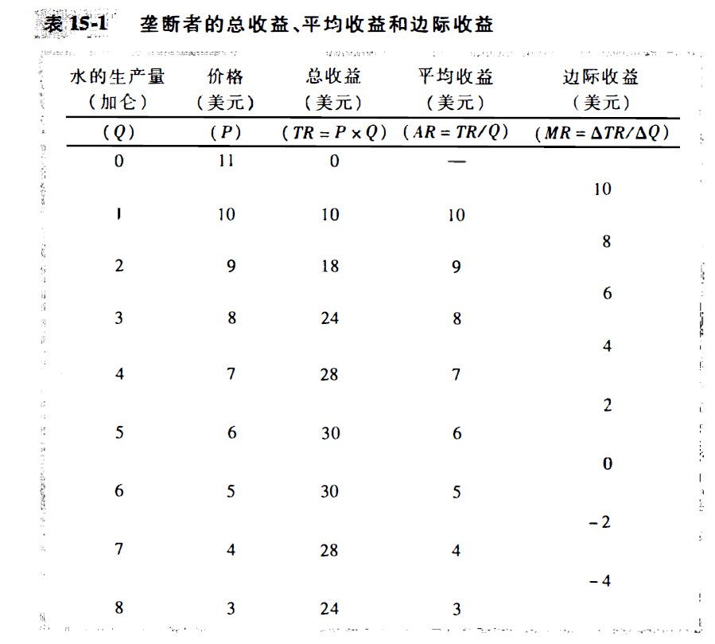
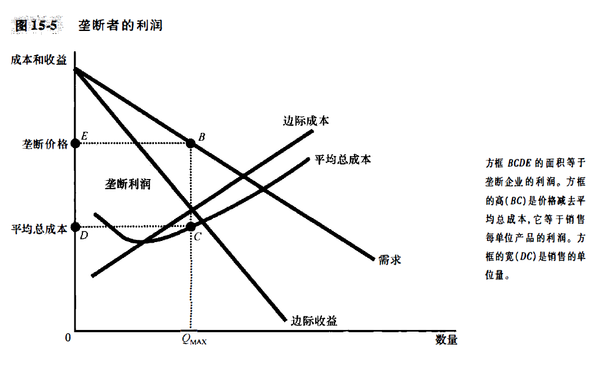
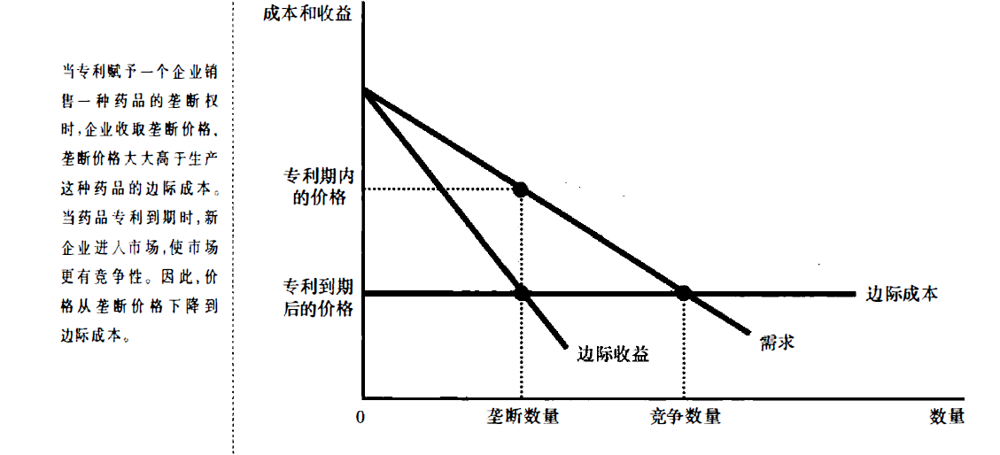
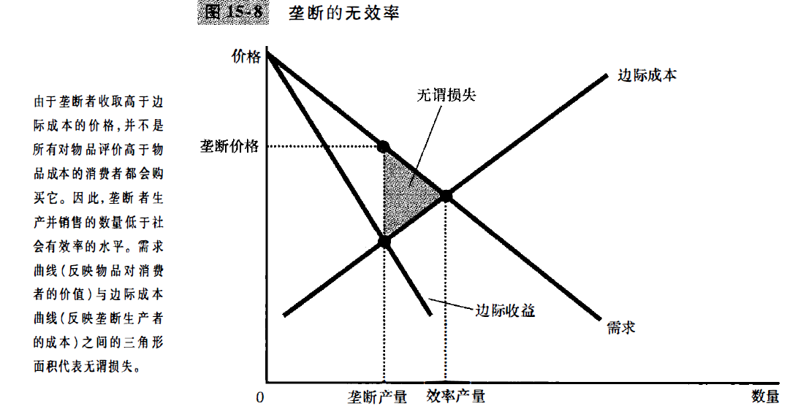
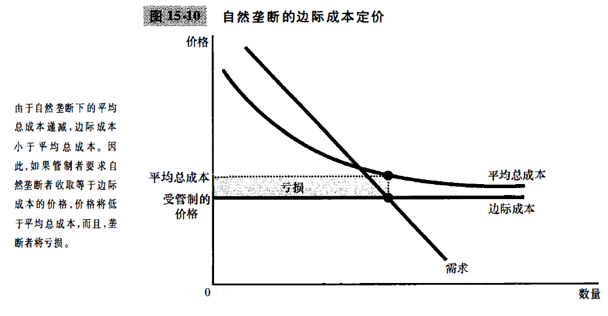
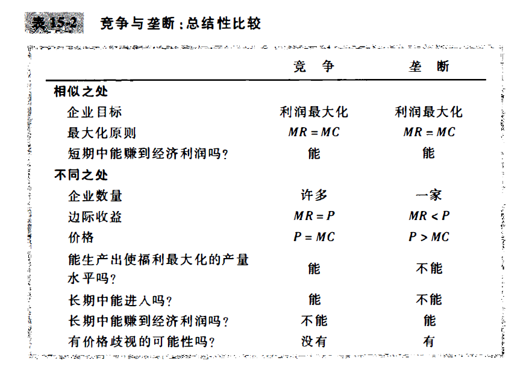

# chapter15-垄断 (page319-343)

TODO: 中国的国企, 垄断, 但是(是严格限制的垄断?不以利润最大化为目标?)

TODO: DeBeers 公司, 与历史上的垄断. 以及人工培育钻石出现之后, 天然钻石的强调

TODO: A股新规, 2026-3-6发布, 2026-4-7施行: 
[【第4号公告】《关于短线交易监管的若干规定》_中国证券监督管理委员会](https://www.csrc.gov.cn/csrc/c101954/c7618648/content.shtml)

以微软公司和Windows操作系统为例子. 微软公司多年以前第一次设计Windows软件的时候, 它申请并获得了政府给予的版权, 该版权授予微软公司**排他性生产和销售Windows操作系统的权利**. 一个人如果想要购买Windows软件, 只能向微软支付其**对该产品制定的价格**, 可以说**微软在Windows软件市场上具有垄断地位**. 

垄断者没有与之相近的竞争者, 因此, 它拥有影响其产品的市场价格的力量. 竞争企业是价格接受者, **垄断企业是价格决定者**

前面我们知道, 竞争企业接收市场给定的产品的价格, 并且选择供给量, 使得价格等于边际成本. 与之相比, 垄断者收取高于其边际成本的价格, 比如windows软件的边际成本(只是将程序复制, 只需要几美元), 但是实际价格确实上百美元.

一个垄断企业可以控制价格, 但是价格过高会导致需求减少, 因此垄断利润并不是无限的. 

另外, 竞争企业和垄断企业都追求利润最大化, 但是对于社会来说, 竞争企业最终会达到提高总体经济福利的均衡, 有垄断的市场的结果往往并不符合社会的最佳利益.
这时候, 考虑经济学十大原理之一, 政府有时候可以改善市场结果. 政府如何应对垄断引起的各种问题, 比如**1994年, 政府阻止微软收购个人财务软件的主销售商Intuit公司, 依据是这两家企业的合并会集中过于强大的市场势力.** 

## 15.1 为什么会产生垄断

**垄断企业**: 如果一个企业是其产品唯一的卖者, 而且其产品并没有相近的替代品, 那么这就是一个垄断企业(monopoly).

垄断产生的基本原因是**进入壁垒**: 其他企业不能进入市场并与之竞争. 进入壁垒的三个主要形成原因: 

1. 垄断资源: 生产所需要的关键资源由单个企业所拥有
   比如 DeBeers 钻石公司, 但是事实上这种原因造成垄断的情况比较少. 
2. 政府管制: 政府给予单个企业排他性的生产某种物品或服务的权利 (TODO: 版权产权?)
   比如专利法和版权法, 专利法允许一些人成为垄断者是为了**鼓励相关研究**, 允许作者成为著作的垄断者是为了**鼓励他们写出更多更好的书**. 
   因此, 专利和版权的相关法律有收益也有成本.
3. 生产流程: 生产成本低于大量企业
   - **自然垄断:** 当一个企业能以低于两个或更多企业的成本为整个市场供给一种物品或服务时, 这个行业就存在自然垄断. 当相关产量范围存在**规模经济**的时候, 自然垄断就产生了.
   - 自然垄断的一个例子是供水, 为了向镇上居民供水, 企业必须铺设遍及全镇的水管网. 如果企业竞争, 每个企业都必须支付固定成本, 如果只有一家企业提供服务, 这个时候水的平均总成本最低.
   - 前面我们讨论公共物品和公共资源的时候, 我们看到了自然垄断的另一些例子. **俱乐部物品, 有排他性, 但是没有消费中的竞争性**, 比如很少使用以至于从不拥挤的桥. 排他性是因为, 收费站可以阻止人过桥, 没有竞争性是因为每个人过桥都不影响其他人. 由于修桥有固定成本, 而增加一个使用者的边际成本微乎其微, 所以, **桥是一种自然垄断**. 
   - 当一个企业是自然垄断企业, 它不需要关心有损其垄断势力的新进入者, 因为新进入者无法实现垄断者同样低或者更低的成本. 
   - 市场规模也是决定一个行业是不是自然垄断的一个因素. 随着市场的扩大, 一个自然垄断市场可能会变成一个更具竞争性的市场. 

TODO: 对于互联网企业来说, 规模经济是显然的. 很容易出现垄断市场? 即使达到了全国市场的层次, 感觉互联网企业仍然是容易造成垄断的...?

## 15.2 垄断者如何做出生产与定价决策

对于一家竞争企业来说, 竞争企业面临的是水平需求曲线, 竞争企业可以在这种价格想卖多少就买多少. 但是, 垄断企业的需求曲线就是市场需求曲线, 垄断者可以通过调整生产的数量, 选择需求曲线上面的任意一点.

那么垄断企业会选择什么样的价格和产量? 我们仍然假设垄断企业的目标是利润最大化, 然后来看.

### 垄断者的收益

考虑一个小镇, 小镇上只有一个水的生产企业. 

我们可以发现, **垄断者的边际收益少于物品的价格**. 

垄断者的边际收益和竞争企业大不相同, 当垄断者增加它销售的数量时, 这对总收益($P*Q$)有两种效应:

- 产量效应: 销售的数量增多, Q增大, 从而可能增加总收益
- 价格效应: 价格下降, P减少, 从而可能降低总收益

### 利润最大化

边际收益等于边际成本的时候, 利润最大化

**在竞争市场上, 价格等于边际成本; 在垄断市场上, 价格大于边际成本.**

### 案例研究: 垄断药品和非专利药品

垄断药品: 价格大于边际成本, 此时价格高, 数量少;
非专利药品: 价格等于边际成本, 此时价格降低, 数量多

## 15.3 垄断的福利代价

垄断会造成无谓损失, 因为需求曲线(价格)与边际成本的交点是有效率产量, 但是边际收益在需求曲线下方, 所以垄断为了利润最大化, 一定会生产 **比效率产量更少的垄断产量**

### 垄断利润: 是一种社会代价?

实际上, 垄断者的获利并不一定造成社会代价, 因为垄断市场上的回来包括消费者和生产者的福利, 我们考察市场总剩余. 如果提高垄断价格不会阻碍消费者购买这些商品, 那么增加的生产者剩余就等于减少的消费者剩余, 那么这个时候没有产生无谓损失.
但是, 如果垄断者为了保持垄断者的地位而产生了额外的成本, 那么垄断的社会损失会包含这些成本.

## 15.4 价格歧视

当一个出版商出版一本新小说时，它先发行昂贵的精装本， 然后再发行便宜的平装本。这两种版本价格之间的差别远远大于其印刷成本的差别。出版商的目标正与我们所举的例子中一样。通过向崇拜者出售精装本和向不太热心的读者出售平装本，出版商**实行了价格歧视并增加了利润**。

我们可以得出结论:

1. 价格歧视是利润最大化垄断者的一种理性策略, 垄断者可以增加利润, 向不同客户收取不同价格, 这更接近顾客的支付意愿
2. 价格歧视要求了, 能根据支付意愿划分顾客; 比如说, 可以从地域上来划分顾客, 比如按照年龄(**所谓的学生优惠, 再比如工作日吃饭...**)
   - 某些市场势力会阻止企业实行价格歧视, 所谓(**套利者**), 比如说学生买学生票卖给成年人
3. **价格歧视可以增进经济福利, 减少了无谓损失**

### 价格歧视的例子

1. 电影票
2. 飞机票价
3. 折扣券
4. 财务援助

## 15.5 针对垄断的公共政策

TODO: 对于中国的国有企业来说, 就是某种垄断? 当拆分国有企业, 意味着增强竞争? 当合并国有企业, 意味着加强垄断, 从而增加利润? 但是这会产生扭曲的激励?

### 1. 使用反托拉斯法增强竞争

反托拉斯法基于政府促进竞争的各种方式. 比如, 政府阻止公司合并, 比如允许政府分拆公司. 

### 2. 管制

在自然垄断的情况下, 比如自来水和电力公司, 这种解决方式是很常见的, 对价格进行管制. 根据定义, 自然垄断下的平均总成本是递减的. **当平均总成本递减的时候, 边际成本小于平均总成本.** 如果管制将价格定为边际成本, 价格就会低于企业的平均总成本, 那么垄断企业一定亏损. 

或者可以补贴垄断者.(税收无谓损失)

或者可以进行平均成本定价. (不能激励企业努力降低成本)

### 3. 公有制

### 4. 不作为

## 15.6 结论: 垄断的普遍性

