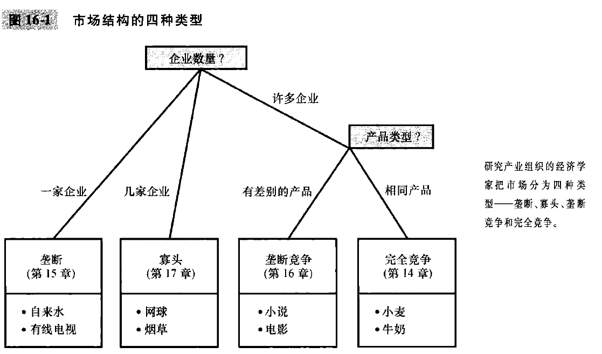
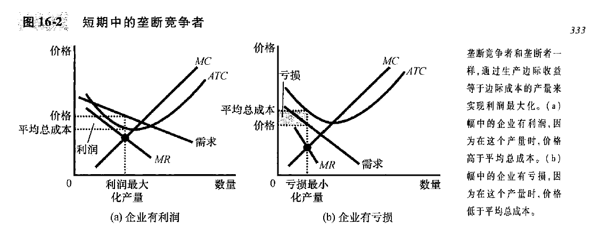
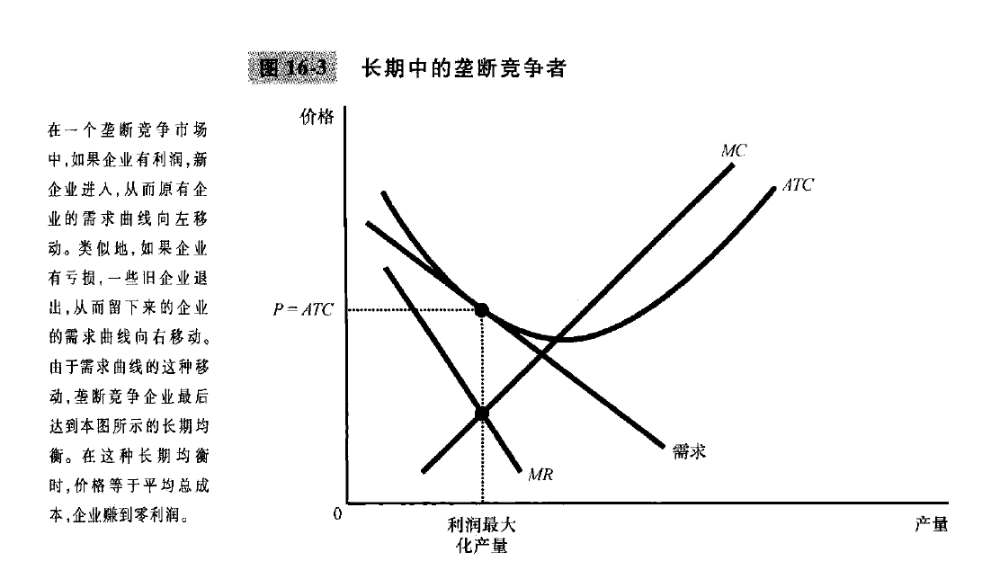
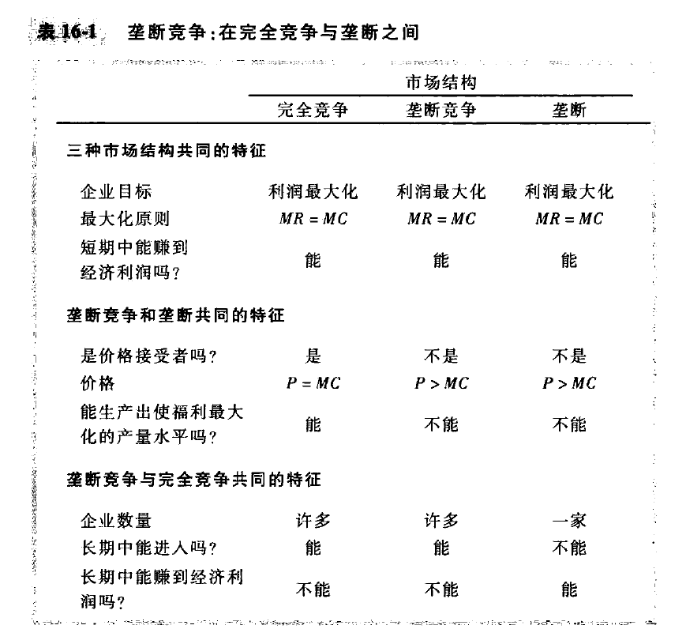

# chapter16-垄断竞争(page349-364)

一方面, 书的市场看起来是竞争性的, 市场上有成千上万的产品可以选择.
另一方面, 书的市场看来又是垄断性的, 出版者在某种程度上可以选择其收取的价格, 这个市场上的卖者是价格决定者, 而不是价格接受者. 

小说市场既不适用于竞争模式, 又不适用于垄断模式, 而应该称为垄断竞争模式. 垄断竞争行业在某些方面是垄断的, 而在另一些方面又是竞争的. **这个模式不仅描述了出版行业, 而且也描述了许多其他物品和服务市场**

TODO: 关于品牌? 同一种产品, 比如冰淇凌, 但是有不一样的品牌, 如何去看?

## 16.1 在垄断和完全竞争之间

经济中一般企业面临竞争, 但是企业又不是完全的价格接受者, 他们具有某种程度的市场势力, 但是市场势力还没有大到成为垄断者. 很多行业介于完全竞争和垄断的极端情况之间的某个位置, 经济学家称这种情况为 **不完全竞争**

不完全竞争市场的一种类型是**寡头(oligopoly)**, 寡头是只有少数几个卖者的市场, 每个卖者都提供与其他企业相似或相同的产品. 经济学家使用 **集中率** 衡量少数企业的市场支配地位, 也就是**四家最大的企业在市场总产量中的百分比**. 
在美国经济中, 大多数行业的四企业集中率小于50%, 但是也有高度集中的行业, 比如电灯泡75%, 早餐麦片, 飞机制造, 家庭洗衣设备, **烟草98%**. 

不完全竞争市场的第二种类型是**垄断竞争(monopolistic competition)**, 他描述一种由许多出售**相似但不相同产品的企业**的市场结构. 在垄断竞争的市场上, 每家企业都垄断着自己生产的产品, 但许多其他企业也生产相似但不相同的产品来争夺同样的顾客. 
垄断竞争市场的特征是:

1. 许多卖者: 许多企业争夺相同的顾客群体
2. 产品存在差别: 每个企业不是价格接受者, 而是面临一条向右下方倾斜的需求曲线
3. 自由进入和退出: 企业可以无限制的进入或退出一个hi长, 因此, 市场上企业的数量会一直调整到经济利润为零时为止.

垄断竞争和寡头的区别很大. 对于寡头来说, 市场上只有几个卖者, 卖者数量少使得激烈的竞争不大可能产生, 并且**卖者之间的策略性相互作用**显得极为重要. 与此相反, 垄断竞争之下由许多卖者, 那么竞争更加激烈. 

## 16.2 差别产品的竞争

### 短期中的垄断竞争企业

短期中的竞争者, 我们仍然找到 MC 与 MR, 边际成本=边际收益的产量, 然后从这个产量得到价格和平均总成本, 如果 $P>ATC$, 那么就可以短期内有利润, 如果 $P<ATC$, 那么就会短期内有亏损.

### 长期均衡

当企业有利润的时候, 新企业就有进入市场的激励. **这种进入增加了顾客可以选择的产品数量, 从而减少了市场已有的每家企业的需求.** 也就是说, 利润鼓励进入, 而进入使得已有企业面临的需求曲线向左移动, 所以这些企业的利润就会下降.
同理, 企业亏损的时候, 旧企业就会退出市场, 这对留下来的企业是好事, 因为每家企业的需求上升了, 从而亏损就会减少, 或者说利润会增加.
**这种进入和退出机制会一直持续到市场上企业正好有零经济利润为止**

注意看, 这里刚好是切线, 需求与ATC相切. 

垄断竞争市场上的长期均衡两个特点:

- 正如在垄断市场上一样, 价格大于边际成本. 因为利润最大化要求边际收益等于边际成本, 但是需求曲线向右下方倾斜, 那么边际收益就会小于价格
- 正如在竞争市场上一样, 价格等于平均总成本. 自由退出和进入使得经济利润为0

### 新闻摘录: 多样性不充分是一种市场失灵

市场的配置资源在某种程度上也和政府类似, 存在某种多数人专制. 印第安人的专用运动鞋, 罕见病的药物, 小地方的航空服务

## 16.3 广告

广告, 许多企业都努力说服你购买它的产品, 这种行为是**垄断竞争(以及某些寡头企业)的一个自然特征**, 企业销售有差别产品, 并收取高于边际成本的价格时, 每个企业都有激励用做广告的方式来吸引更多的买者来购买自己的特定产品. 

### 1. 关于广告的争论

用于广告的资源是不是一种社会浪费?

广告的批评者: 认为企业做广告是为了操纵人们的爱好, 许多广告是心理性的, 而不是信息性的(比如饮料广告, 但是重点是沙滩,一群人和派对). 
批评者还认为, 广告抑制了竞争, 广告向消费者夸大各产品之间的差别. 通过增加 **产品差别意识, 增加品牌忠诚度**, 这样的话买者就会不关心相似产品的价格差, 从而使某一特定品牌的需求 **更缺乏弹性**. 在需求曲线缺乏弹性时, 每个企业都要收取高于边际成本的价格加成. 

广告的辩护者: 广告用来提供信息, 让顾客更好选择想购买的产品, 从而提高市场有效配置资源的能力. 
辩护者还认为促进了竞争, 顾客更容易获得全面的信息
广告使得新企业容易进入, 帮助新企业吸引顾客

随着时间的推移, **决策者逐渐接受了广告可以使得市场更具竞争性的观点**. 过去对于某些职业广告的管制, 比如律师等等, 这种广告的限制抑制了竞争.

### 2. 作为质量信号的广告

企业愿意用大量的钱来做广告, 这本身就向消费者传递了一个**所提供产品质量的信号.**

TODO: 比如说花钱做广告做到央视, 本身就是一种背书?

### 3. 品牌

批评者认为: 品牌使消费者感觉到**实际上并不存在的差别**. 批评者认为, 消费者对有品牌物品支付意愿更高, 是广告引起的非理性的一种形式. 
批评者认为, 品牌对经济来说是一件坏事.

近年来, 经济学家为了品牌进行辩护, 第一, 品牌向消费者提供了在购买前不宜判断的产品质量的信息; 第二, 品牌向企业提供了**保持高质量的激励**, 因为企业有保持自己品牌声誉的财务利害关系.
*TODO: 这样的激励是扭曲的吗? 保持高质量是维护声誉的办法之一, 但是公关, 舆论造势等等? 这对产品没有帮助但是维护声誉, 这对经济是好的吗?*

## 16.4 结论

垄断竞争, 是垄断和竞争的结合.

由于垄断竞争企业生产有差别的产品, 因此每个企业都要靠做广告打出自己的品牌来吸引顾客; 某种程度上, 广告操纵了消费者的偏好, 促成了非理性的品牌忠诚, 抑制了竞争; 更大程度上, 广告提供了信息, 促进了竞争.

