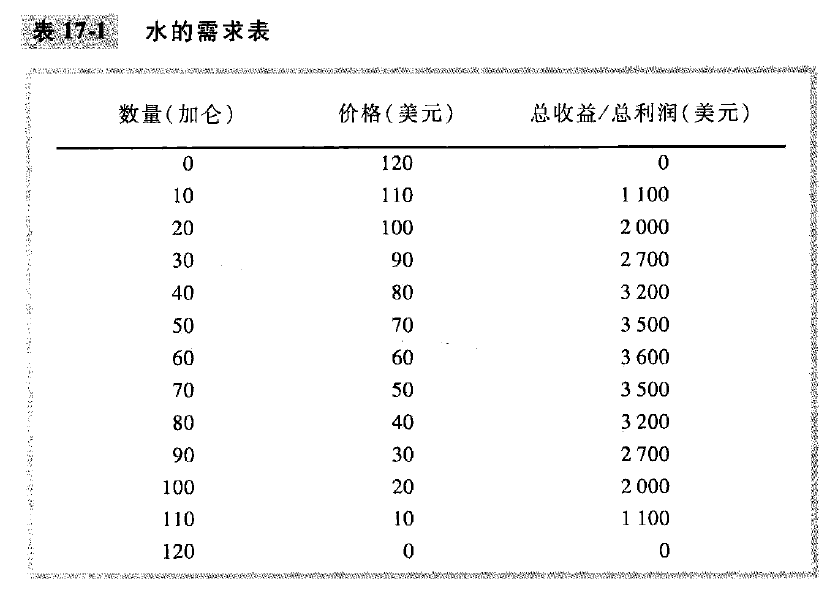
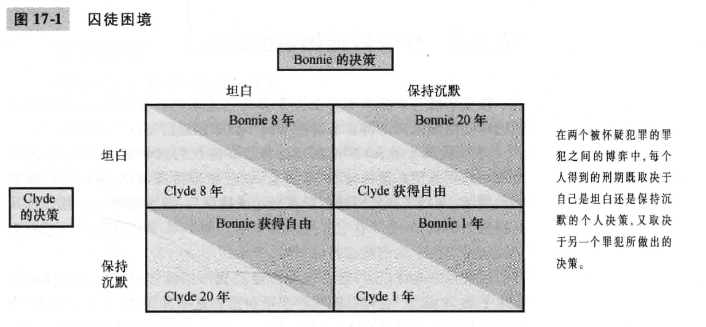

# chapter17-寡头(page368-388)

## 17.1 只有少数几个卖者的市场

### 1. 双头的例子

### 2. 竞争,垄断和卡特尔

如果 Jack 和 Jill 联合起来, 并就水的生产量和收取的价格达成一致. 企业之间有关生产与价格的这种协议被称为 **勾结(collusion)**, 而且联合起来行事的企业集团被称为 **卡特尔(cartel)**, 一旦形成了卡特尔, **市场实际上就是由一个垄断者提供服务**

如果形成卡特尔, 那么两个生产者就会总共生产60单位水, 这个时候两个人的总利润最大. 另外, 卡特尔的每个成员都想要有较大的市场份额, 因为市场份额越大, 利润就越大.

### 新闻摘录: 公开的价格勾结

大多数公司都指定遵从 **反托拉斯法** 的政策, 这些政策表明**公司不应该与竞争对手就固定价格进行协商**. 但是, 公司可以在不违背规则的前提下协商议价吗?

比如: 当价格在私人之间协商, 顾客自愿提供竞争对手的价格来获取优势是很正常的. 
比如: 公司可能向市场公布报告, 发给股票持有者;

### 3. 寡头的均衡 (纳什均衡)

## 17.2 合作经济学

通过**囚徒困境(prisoners’ dilemma)**, 我们关注为什么, 即使在合作使得所有人状况变好时, 人们在生活中也往往不能相互合作. 

**占优策略(dominant strategy)**, 指的是无论其他参与者采取什么策略, 这个策略都是一个参与者可以采取的最好的策略;

假如 A 和 B 两个寡头都约定生产低产量, 但是两人都有违背协议的激励. 对于A来说, 无论B生产低产量还是高产量, 自己生产高产量反而是 **占优策略**;

### 案例研究: OPEC和世界石油市场

### 囚徒困境的其他例子

1. 军备竞赛: 美国和苏联, 类似于囚徒困境;
2. 公共资源: 人们倾向于过度使用公共资源, 无论对方是不是过度使用, 自己的过度使用是占优策略

### 囚徒困境与社会福利

某些情况下, 非合作均衡对于社会和参与者来说都是不利的, 比如美国和苏联;

但是某些情况下, 不合作对于参与与者来说不利, 但是对于整个社会来说是有利的, 比如两个高产量的石油公司, 这样石油产量会更接近社会福利最大化的产量; 这时候更接近于竞争;

### 人们有时能合作的原因

多次博弈的囚徒困境

## 17.3 针对寡头的公共政策

### 1. 贸易限制和反托拉斯法

克莱顿法: 一个人如果可以证明他受到限制贸易的非法协议的危害, **私人可以提起诉讼**

### 2. 关于反托拉斯政策的争论

1. 转售价格维持
2. 掠夺性定价: 降价, 把竞争对手赶出市场, 然后提高价格
3. 搭售, 捆绑销售: 被认为是某种价格歧视的方法; 或者也可能是一种扩大市场势力的方法, 但是目前的不利影响尚不明确

### 案例研究: 微软案

1998, 美国政府起诉微软公司, 操作系统与浏览器捆绑销售;
