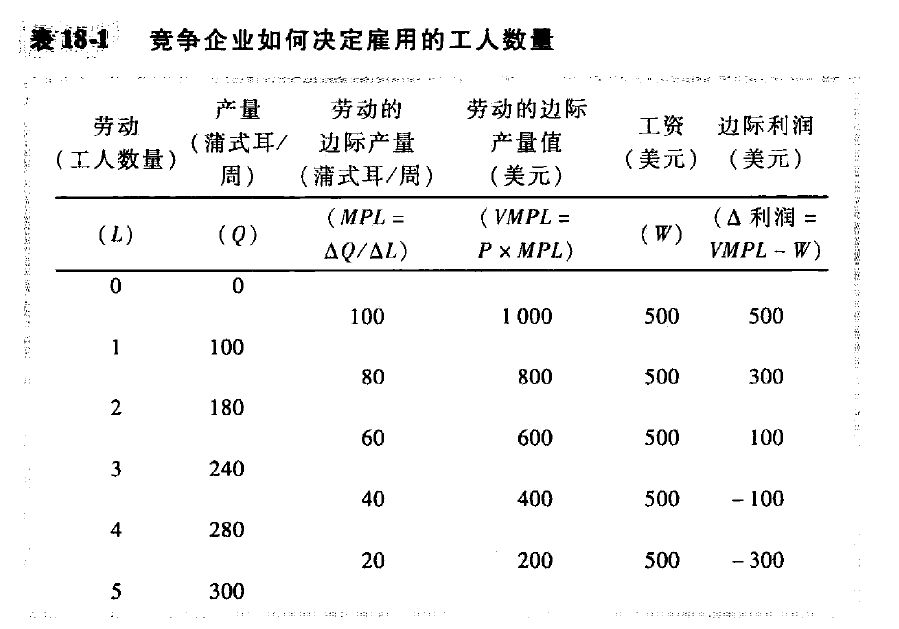
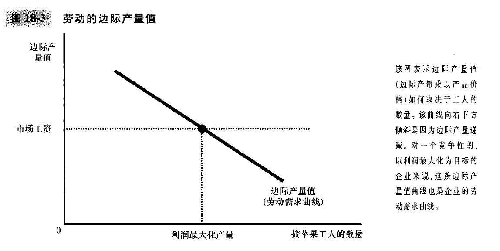
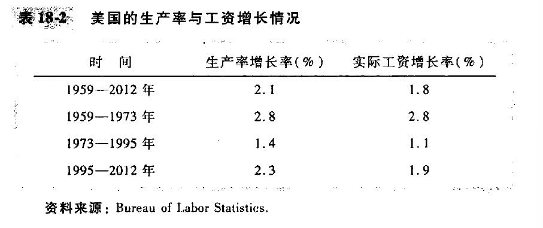

# 第6篇: 劳动市场经济学

# chapter18-生产要素市场(page397-page415)

2012年美国居民的总收入是15万亿美元左右, 人们以各种方式赚到这种收入. **工人以工资和福利津贴的形式赚到总收入的2/3, 其他部分以租金,利润和利息的方式归土地所有者和资本所有者 -- 资本是经济中设备和建筑物的存量. 但是, 什么因素决定了多少归工人, 多少归土地所有者, 多少归资本所有者?**

下面, 我们要去考察**劳动, 土地和资本**的供给与需求, 从而尝试回答上面的问题. 

本章将阐述分析要素市场的基本理论, **生产要素(factors of production)是用于生产物品与服务的投入**. **劳动, 土地和资本是三种最中重要的生产要素.**

在许多方面, 要素市场类似于我们在前几章中分析的物品与服务市场, 但两者在一个重要的方面有所不同: 生产要素的需求是 **派生需求**, 也就是说, 企业的生产要素需求是从 它向另一个市场供给物品的决策派哼出来的, 比如说, 对电脑程序员的需求与电脑软件的供给有不可分割的联系.

## 18.1 劳动的需求

### 18.1.1 竞争的, 以利润最大化为目标的企业

比如一个企业, 有一个苹果园, 每周必须决定雇佣多少工人来摘苹果. 另外有两个假设:

1. 假设我们的企业在苹果市场上(在该市场上企业是卖者) 和摘苹果工人市场上(在该市场上企业是买者)都是**竞争性的**. 竞争企业是价格接受者. 
2. 假设, 企业是追求**利润最大化**的, 所以企业并不直接关心它雇佣的工人数和生产的苹果两, 最关心利润最大化.

可以通过生产函数来描述生产中使用的投入量和产量之间的关系, 投入是摘苹果的工人, 而产出是苹果; 
另外, 我们考虑劳动的边际产量, 增加一单位劳动所引起的产量增加量. 以及**边际产量值(value of marginal product)**, 就是边际产量乘以市场价格, 也就是边际收益;
考虑企业要雇佣多少工人, 因为工人工资是固定的, 第一个工人的边际利润是500, 然后第二个工人的边际利润是300, 然后第三个公认的边际利润是100, 更多的人虽然增加总收益, 但是也增加总成本, 并且实际上边际利润为负数.

于是, 我们可以得出结论: **一个竞争性的, 利润最大化企业雇佣的工人数要达到使得劳动的边际产量值等于工资的那一点. 以及, 对一个竞争性的, 利润最大化的企业来说, 边际产量值曲线也是劳动需求曲线.**

TODO: 所以说, 企业占有了一些多余的利润? 就是边际产量逐渐递减之前, 大于工人工资的那一部分?

### 参考资料: 投入需求与产量供给: 同一枚硬币的两面

### 18.1.4 什么引起劳动需求曲线移动

1. 产品价格: 比如产品价格上升, 那么边际产量值上升, 劳动需求曲线上升
2. 技术变革: 
   - 技术进步通常增加劳动的边际产量, 从而增加了劳动需求, 并使得劳动需求曲线向右移动
   - 技术变革也可能减少劳动需求. 比如廉价的工业机器人的发明可能减少劳动的边际产量, 劳动曲线向左移动, 经济学家称之为 **劳动节约型的技术变革**; 但是历史表明大多数技术进步是 **劳动扩张型的**, 这种技术进步解释了在工资上升时就业持续增加的现象
3. 其他要素的供给: 比如梯子供给的减少可能影响摘苹果工人的边际产量, 从而减少了对工人的需求

## 18.2 劳动的供给

TODO: 为什么说所谓风口, 跑的快的人可以赚到钱, 然后早离场? 我们思考一下这里的内容, 比如说, 一个行业内的工资假如是竞争的, 那么就会趋于平均; 所有人看到这个行业的利润, 就会涌进来, 也就是所谓的供给曲线右移, 然后价格就会降低, 直到利润为0, 这个过程中劳动力产生了一定的分散和移动?

劳动供给的正式模型将在第21章给出, 在那里将会提出 **家庭决策理论**, 这里, 我们简单而非正式的讨论在劳动供给曲线背后的决策

### 18.2.1 工作与闲暇之间的权衡取舍

我们可以假设劳动供给曲线向右上方倾斜, 也就是说工资上升使得工人增加他们供给的劳动量. 由于时间是有限的, 工作时间越多意味着闲暇的时间变少.

但是劳动供给曲线也不一定是向右上方倾斜的. 假如说工资上涨, 但是你可能选择去享受更多的闲暇. 这样的话, 劳动供给曲线就会向后弯曲, 在21章中, 我们将会讨论收入效应和替代效应, 这里暂时假设劳动供给曲线向右上方倾斜.

### 18.2.2 什么引起劳动供给曲线移动

1. 爱好变动(文化层面)
2. 可供选择的机会改变, 比如某个市场的工资忽然变高
3. 移民, 国内移民和国外移民

## 18.3 劳动市场的均衡

**结论: 改变劳动供求的任何事件, 都必定使得均衡工资和边际产量值等量变动, 因为这两个量必定总是相等的**

### 新闻摘录: 移民经济学

### 18.3.2 劳动需求的移动

假如说苹果忽然涨价了, 那么边际产量值就会上升, 那么劳动需求曲线就会上升, 均衡工资也会上升
**这种分析表明: 一个行业中企业的繁荣程度往往和这个行业中公认的繁荣程度是密切相关的.**

### 案例研究: 生产率与工资

第一章中我们提到经济学十大原理之一: **我们的生活水平取决于我们生产物品和服务的能力**

劳动需求分析表明, 工资等于用劳动的边际产量值衡量的生产率, 也就是说, 生产率高的工人工资也高, 生产率低下的工人工资也低. 
上面的结论可以用来理解, 为什么现在的工人比前几代工人状况更好. 生产率和工资之间有非常紧密的联系

TODO: 如果这么说, 最后一个无关紧要的程序员所带来的收益, 就是整个程序员的平均工资, 这样来看的话, 公司实际上拿到了大量的利润??? 以及对比不同行业的情况下, 公司利润更高的企业的员工, 就会拿到更高的工资? 这样说的话, 那华尔街的高工资实际上说明了金融机构的高收入? 

### 参考资料: 买方垄断

假如说, 一个小镇的劳动市场由一个大雇主支配, 那么这个人就对现行工资有非常大的影响, 这种只有一个买方的市场就成为买方垄断

TODO: 对于高精尖人才来说, 就是类似于垄断的地位, 所谓企业花非常高的价格去 “挖墙脚”, 就是因为供求关系的情况? 供不应求, 这种情况下, 价格就会不断进行提升

## 18.4 其他生产要素: 土地和资本

我们可以把企业的生产要素分成三类: 劳动, 土地和资本. 在这里, **资本(capital)指的是用于生产物品和服务的设备和建筑物**

### 18.4.1 土地和资本市场的均衡

这里需要区分两种价格: **购买价格和租赁价格**. 购买价格是: 一个人为了无限期的拥有那些生产要素而支付的价格; 租赁价格是: 一个人为了在一个有限时期使用那些生产要素而支付的价格; 我们后面会看到, 这些价格是由略有不同的经济力量决定的.

我们前面的分析, **工资是劳动的租赁价格**, 所以我们可以同样的推导出来土地的租赁价格, 资本的租赁价格是由供给和需求决定的. 而且: **无论是土地还是资本, 企业会一直增加对他们的租用量, 直到要素的边际产量值等于要素的价格时为止**; 因此, 每种要素的需求曲线, 反映了该要素的边际生产率. 

现在我们可以解释多少收入归工人, 多少收入归土地所有者, 多少收入归资本所有者了. 只要使用生产要素的企业是竞争性的和利润最大化的, 每种要素的租赁价格必须等于该要素的边际产量值. **劳动, 土地和资本各自赚到了它们在生产过程中的边际贡献的价值**

现在考虑土地和资本的购买价格. 租赁价格和购买价格是相关的: 如果土地或资本能产生有价值的租赁收入流, 买者就愿意花更多钱去买一块土地或资本. 而且, 正如我们刚刚所说的, 任何一个时间点的均衡租赁收入等于要素的边际产量值. 因此, 一块土地或资本的均衡购买价格, 取决于当前的边际产量值以及预期未来会有的边际产量值

### 参考资料: 什么是资本收入

### 18.4.2 生产要素之间的关系

**改变任何一种生产要素供给的事件, 会改变所有要素的收入**

### 案例研究: 黑死病的经济学

14世纪的欧洲, 鼠疫的流行在短短几年内夺取了大约三分之一的人口的生命. 

黑死病之后, 那些幸存者的影响是什么? 我们可以考察人口减少对劳动的边际产量和土地的边际产量的影响. 在工人供给减少时, 劳动的边际产量增加了(这是边际产量递减在相反方向起作用). 因此, **我们估计黑死病提高了工资**

由于土地和劳动共同用于生产, 工人供给减少也影响土地市场. 由于可用于耕种的工人数量少了, 所以增加一单位土地所生产的额外产量少了. 换句话说, 土地的边际产量减少了. 

事实证明, 工资翻了一番, 租金减少了50%.

## 18.5 结论

本章解释了劳动, 土地和资本如何由于它们在生产中所起的作用而得到报酬. 这里所提出的理论称为 **新古典分配理论**

