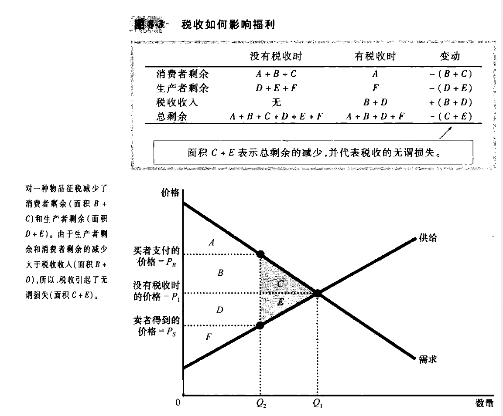

# chapter8-应用: 赋税的代价(page167-181)

## 8.1 赋税的无谓损失

如果 $T$ 是税收规模, $Q$ 是物品销售量, 那么政府得到的总税收收入就是 $T \times Q$. 同时应该记住, 这种利益实际上**并不归政府所有**, 而是归那些得到这种收入(公共利益)的人所有.

我们需要考察 没有税收时的福利 与 加上税收之后的福利的情况, 下面的这张图可以很直观的表现出来. 并且, 图中指出, 加上税收以后, 消费者剩余减少, 生产者剩余减少, 政府的总税收收入增加, 但是 **总剩余减少了**, 这代表**税收的无谓损失**

另外, 我们可以发现, 无谓损失的最终来源是, 它是买者和卖者不能实现某些贸易的好处.

## 8.2 决定无谓损失的因素

供给和需求的价格弹性, 决定了无谓损失的大小.

我们可以发现, **供给和需求的弹性越大, 无谓损失就会越大.** 这也比价容易理解, 弹性小的时候, 买者和卖者对于税收更不敏感, 更不容易退出市场, 这个时候贸易量的减少更少, 无谓损失也就更少.

## 8.3 税收变动时的无谓损失和税收收入

从小额税, 到中额税, 到大额税;
无谓损失一直增加, 并且呈现二次函数, 单调递增; 
税收收入先增加后减少, 开口向下的二次函数
