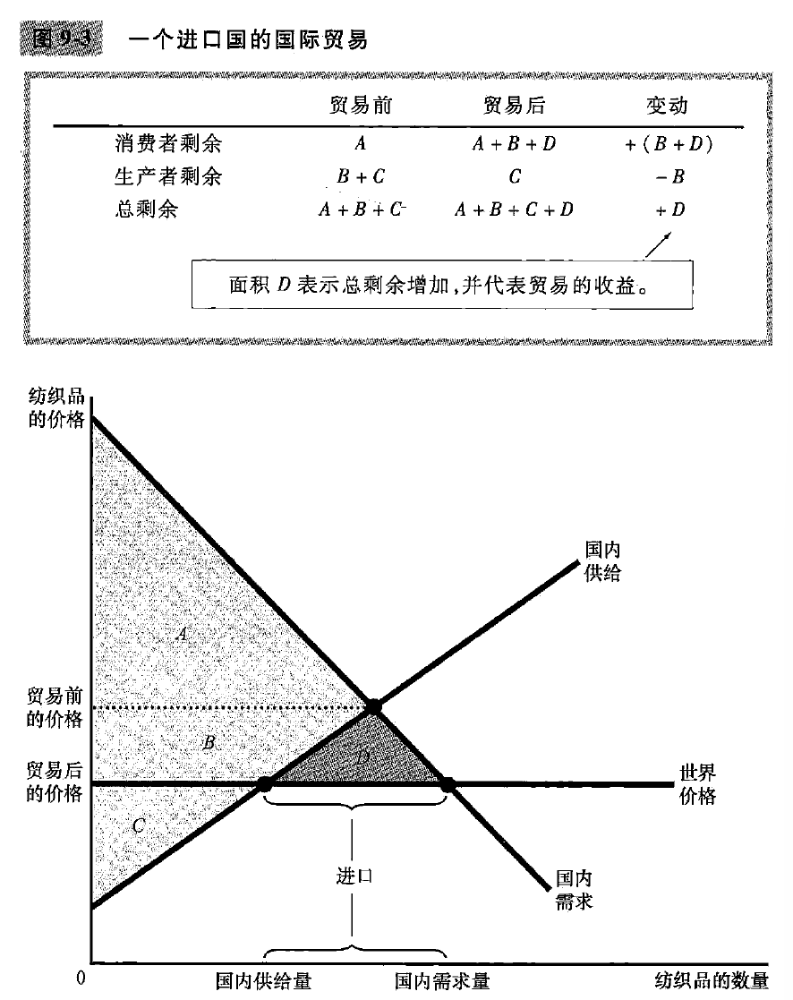
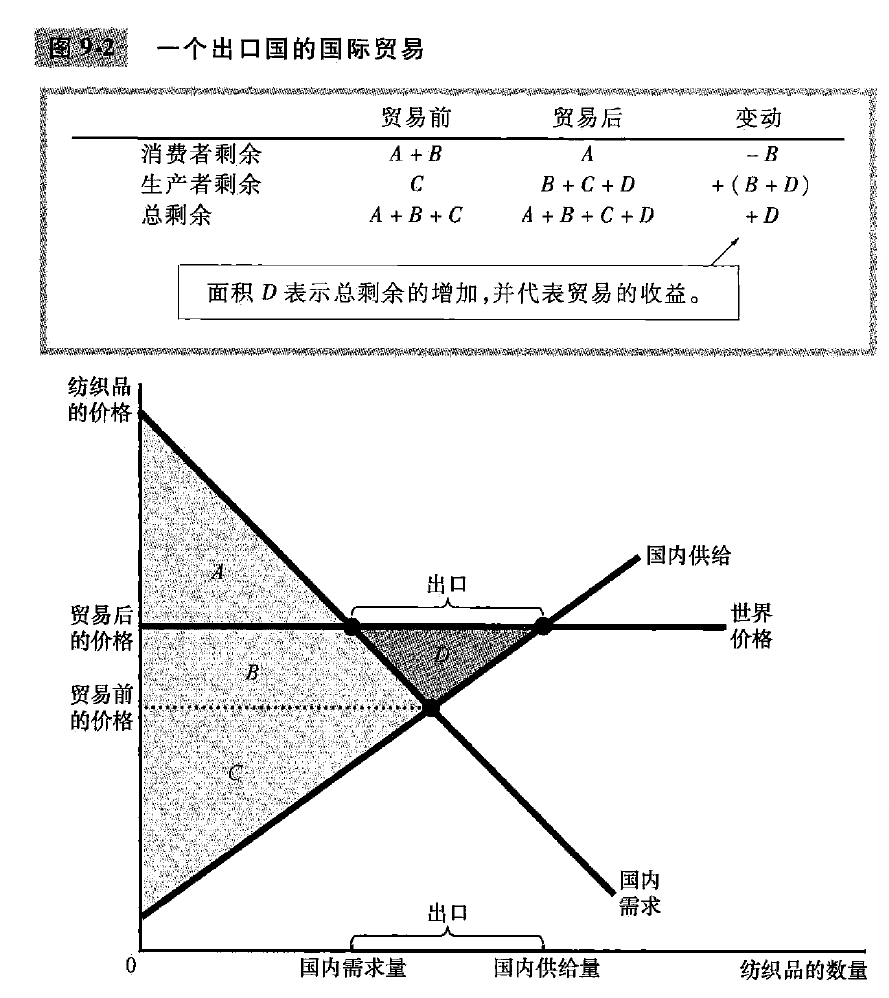

# chapter9-应用: 国际贸易(page185-204)

## 9.1 决定贸易的因素

下面, 使用纺织品市场作为例子, 并且一个假想的 I 国家的纺织品市场. 

从没有国际贸易到有国际贸易, I国需要回答三个问题:

1. 如果政府允许进口和出口纺织品, 国内纺织品市场的纺织品价格和纺织品销售量会发生什么变动?
2. 谁将从纺织品的自由贸易中获益? 谁将遭受损失? 好处会大于损失吗?
3. 应该把关税(对纺织品进口征税)作为新贸易政策的一部分吗?

### 世界价格与比较优势

我们要对比国内价格和世界价格, 世界价格是世界市场上通行的价格称为世界价格. 如果国内价格高于世界价格, 那么就会称为进口国, 反过来就变成出口国. 

从本质上来说, 比较贸易之前的世界价格和国内价格, 就可以说明 I国 在这种产品上到底有没有比较优势.

## 9.2 贸易的赢家和输家

为了分析, 我们假设 I国是**小型经济**, 也就是说 I国 对于世界市场的影响微不足道. 

### 出口国的得失

一旦开始了自由贸易, 那么贸易后的价格就变成了世界价格, 因为没有卖者愿意用低于世界价格的价格卖出纺织品, 买者也希望用最低的价格买回纺织品. 

我们可以发现, 消费者剩余从 $(A+B)$ 变成了 $(A)$, 减少了, 但是生产者剩余从 $(C)$ 变成了 $(B+C+D)$, 而且总剩余还增加了, 增加了一个 $(D)$
另外, 国内需求量小于国内供给量, 插值就是**出口**的部分.

结论:

- 当一国允许贸易并成为一种物品的**出口者**时，**国内该物品生产者的状况变好了，而国内该物品消费者的状况变坏了**。
- 从赢家收益超过了输家损失的意义上说，**贸易使一国的经济福利增加了**。

### 进口国的得失

整体上来看, 国际贸易让所有国家变好了. 但是, 这个政策(国际贸易)创造了赢家和输家, 政治斗争就登上了舞台!

### 关税的影响

**关税: 对在国外生产而在国内销售的物品征收的一种税**, 是对进口物品征收的一种税. 

实际上, 只有 I国 是一个**进口国**的时候, 才会关心关税的实际影响. 

当增加关税的时候, 进口纺织品和国内纺织品的价格都上升, 上升幅度等于关税量, “从而更接近没有贸易时的均衡价格”

仍然分析消费者剩余, 生产者剩余, 政府收入, 总剩余的变动情况;
我们发现, 关税提高了纺织品价格, 国内需求量减少, 国内供给量增加. 关税减少了进口量, 并使得国内市场向没有贸易时的均衡移动.

关税会导致无谓损失, 消费者剩余会出现减少, 生产者剩余增加, 政府收入会增加, 总体来看总剩余会减少, 因为资源的配置背离了最优水平.

### 参考资料: 进口配额: 另一种限制贸易的方法

结论是: 进口配额和关税很相似.

### 国际贸易的其他好处

- 可以增加物品的多样性
- 通过规模经济降低了成本: 一些物品只有大量生产时, 才能以低成本生产, 这种现象称为**规模经济**
- 增加了竞争
- 加强了思想交流

### 新闻摘录: 对自由贸易的威胁

在2012年, 随着美国和世界许多其他国家正慢慢从严重衰退中复苏, 贸易限制又被许多决策者当作不可抗拒的临时政策. 

“保护主义”的回归.

## 9.3 各种限制贸易的观点

### 工作岗位论

### 国家安全论

出于对国家安全的合理考虑, 保活关键行业可能是合理的. 

### 幼稚产业论

### 不公平竞争论

S国对于特定产业生产有补贴, 那么 I国 是否要对这种不公平竞争做出反应?

其实不需要, 补贴也许是不好的策略, 但是这影响的是 S国, I国依然可以获得自由贸易的利益.

### 作为讨价还价筹码的保护论

### 新闻摘录: 关于自由贸易的再思考

美国长期以来从第三世界进口石油等原材料, 通常从加拿大, 欧洲, 日本等国进口制成品. 

但是, 后来, 美国从第三世界进口的制成品数量变多.
对于世界经济的整体, 特别是穷国来说, 高工资国家与低工资国家贸易是很好的事情. 落后国家提升收入水平变得更有希望.
但是, 对于美国工人来说, 美国从第三世界进口制成品, 会导致美国许多工人的工资降低. 

经济发展相似的国家贸易, 两边都是赢家; 但是经济发展极为不同的时候, 会出现大量的赢家和输家. 
举例来说, 美国受教育程度高的工人也从贸易带来的更高工资和更多工作机会中收益. 比如 thinkpad 通过中国公司“联想”生产, 但大量研发工作在美国本土.
但是, 受过较少正规教育的工人会发现, 自己的工作岗位被竞争到了海外, 沃尔玛的低价格却并不足以补偿他们的损失. 

自由贸易通常能使一国更富, 但是没有说自由贸易通常对于每个人都是好的. 从这个角度来看, 自由贸易似乎使得少数人收益, 而使大部分人受损了.

## 9.4 结论

美国在历史上, 一直允许各州之间进行无限制的贸易, 国家作为一个整体也从贸易带来的专业化中收益. 

**我们所说的, 要素市场化, 建成全国统一大市场, 中国的政策**
